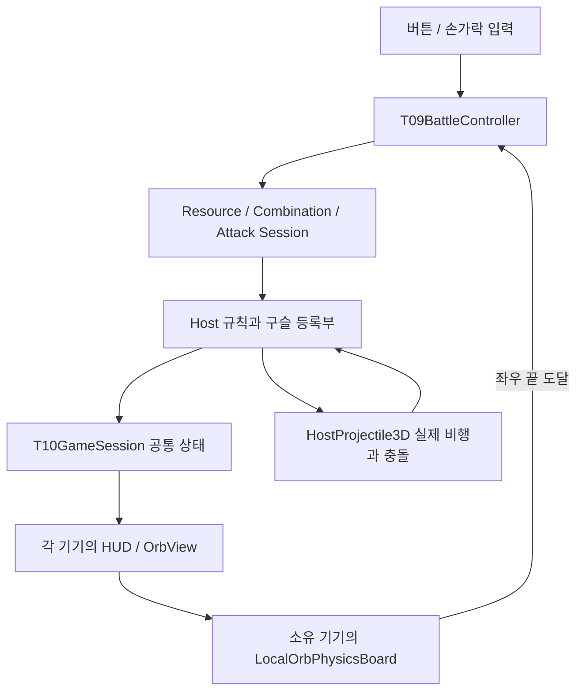

> **공개 이관본 안내:** 이 문서의 개인 경로·서명 식별자는 예시로 일반화했습니다. `/path/to/...`, `YOUR_TEAM_ID`, `HOST_IPV4`는 자신의 환경 값으로 바꾸세요. 원시 증거와 과거 문서 묶음은 공개하지 않으며 [검증 요약](VALIDATION_SUMMARY.md)·[이관 범위](MIGRATION.md)에서 구분합니다. 과거 기록의 완료·미완료 상태는 새 실행 결과가 아닙니다.

# C6 / 합이오 Unity 코드 읽기·유지보수 실습 안내서

**처음 Unity를 개발하는 사람을 위한 보고서 3 — 실제 코드에서 원인을 찾고, 작은 변경을 확인하는 방법**

| 기준 | 내용 |
|---|---|
| 작성일 | 2026-09-14 |
| 설명하는 구현 | 빌드24 `ContinuousTransferBattle`, 소스 기준 커밋 `fa9dc67` |
| 개발 환경 | Unity 6000.5.7f1, URP 17.5.0, NGO 2.13.1, Transport 6.5.0, Input System 1.20.0, Test Framework 1.7.0 |
| 독자·목적 | Unity·C# 초보자가 기존 프로토타입의 실행 흐름을 이해하고 유지보수하기 |
| 함께 읽기 | [보고서 1: 프로젝트 준비와 기본 게임](UNITY_BEGINNER_DEVELOPMENT_REPORT.md), [보고서 2: 물리·다인 연결 확장](UNITY_BEGINNER_PHYSICS_MULTIPLAYER_REPORT.md) |
| 빌드 방법 | [현재 P4 실행 안내](P4_RUNBOOK.md), [Unity·Xcode 상세 안내](../BUILD_README.md) |

이 문서는 **실제 구현 설명**, **소스에서 가져온 발췌**, **앞으로 해볼 실습 예시**를 구분한다. 예시를 문서에 작성한 것과 프로젝트에 적용·컴파일·실행한 것은 다르다. 이번 작성에서는 게임 코드를 변경하거나 Unity 테스트·앱 빌드·실기기 검사를 새로 실행하지 않았다. 기존 결과는 [P4 검증 보고서](P4_VALIDATION.md)를 따른다.

소스 링크는 공개 조직 저장소에 이관된 [게임 소스](../Assets/_Project/HapioMVP)로 연결된다. 설명 기준 `fa9dc67`은 원본 저장소의 커밋 번호이며 이관 저장소에 그 Git 이력을 복사한 것은 아니다. 이번 이관 snapshot에는 설명하는 게임 코드가 포함되어 있다. 상대 링크는 현재 보고 있는 브랜치의 파일을 열므로, 이후 코드가 바뀌면 함수명을 검색하고 [이관 기록](MIGRATION.md)의 기준과 비교한다. `T09`, `T10`, `P2`처럼 과거 Task 이름이 붙어 있어도 최신 씬에서 계속 쓰는 클래스가 있다.

**목차 — 필요한 주제로 바로 이동**

1. [이 문서를 읽고 할 수 있어야 하는 일](#chapter-1)
2. [Unity 창과 C# 파일을 연결해서 보기](#chapter-2)
3. [C# 구문을 실제 프로젝트로 읽는 법](#chapter-3)
4. [시작·업데이트·설정 복사 흐름](#chapter-4)
5. [전체 구조: 화면·요청·승인·표시](#chapter-5)
6. [생성 버튼에서 화면에 구슬이 나타나기까지](#chapter-6)
7. [구슬 조합과 수명을 관리하는 방법](#chapter-7)
8. [2~5인 방과 시작 조건을 읽는 방법](#chapter-8)
9. [메시지, 일관된 상태와 Retry를 유지보수하는 방법](#chapter-9)
10. [입력·조합·2D 물리를 코드로 따라가기](#chapter-10)
11. [좌우 연속 전달은 로컬 물리와 Host 승인을 연결한다](#chapter-11)
12. [직접 확인하는 연습: 입력·물리·조합·전달](#chapter-12)
13. [3D 투척 입력 계산을 읽을 때 2D 샘플러와 구별하기](#chapter-13)
14. [3D 공격을 코드로 따라가기](#chapter-14)
15. [몬스터 Prefab을 바꾸면서 판정을 유지하는 방법](#chapter-15)
16. [로그와 중단점으로 한 발의 문제를 조사하기](#chapter-16)
17. [기존 테스트를 유지보수 설명서로 읽는 방법](#chapter-17)
18. [Console과 중단점으로 실제 실행 확인하기](#chapter-18)
19. [기존 테스트를 선택해 읽고 실행하는 방법](#chapter-19)
20. [따라 해볼 작은 유지보수 실습](#chapter-20)
21. [증상별로 어디부터 읽을지](#chapter-21)
22. [수정 기록과 GitHub에 남길 범위](#chapter-22)
23. [기준 코드의 해당 줄로 바로 이동](#chapter-23)

<a id="chapter-1"></a>

## 1. 이 문서를 읽고 할 수 있어야 하는 일

전체 파일을 처음부터 끝까지 암기할 필요는 없다. “화면에서 한 행동”을 골라 **입력 → 요청 → Host 승인 → 상태 반영 → 표시**를 한 번 따라가면 된다.

첫 학습은 다음 순서로 진행한다.

1. 씬과 Inspector에서 현재 게임의 연결을 찾는다.
2. `T09BattleController.Start()`에서 GENERATE 버튼과 메서드의 연결을 읽는다.
3. Generate 흐름을 따라 “화면에 원 하나를 그리는 것”과 “비용을 내고 실제 구슬을 등록하는 것”을 구분한다.
4. 움직임에 관심이 있다면 입력·2D 물리·연속 전달 장으로, 공격에 관심이 있다면 투척·피격 장으로 이동한다.
5. 콘솔·중단점·테스트 장에서 **확인 도구 하나**를 골라 이미 있는 기능을 관찰한다.
6. UI 문구나 Config 값 한 개를 바꾸는 작은 실습으로 시작한다.

확인할 때에는 “잘 안 된다” 대신 한 문장으로 조건을 적는다. 예: “빌드24, iPhone P1에서 Raw를 오른쪽으로 민 뒤 손을 놓았다. 왼쪽으로 다시 돌아와야 할 구슬이 iPad 끝에서 멈췄다.” 이 조건이 있어야 입력, 소유권, 속도, 수신 한도 중 어디를 먼저 볼지 정할 수 있다.

<a id="chapter-2"></a>

## 2. Unity 창과 C# 파일을 연결해서 보기

### 먼저 열 파일

Unity Hub에서 `Assets`·`Packages`·`ProjectSettings`가 나란히 있는 **조직 저장소 루트 폴더 전체**를 지정해 연다. `Assets`만 별도 프로젝트로 열지 않는다. 이미 같은 폴더가 열려 있으면 그 Editor를 사용한다.

Project 창에서 [ContinuousTransferBattle.unity](../Assets/_Project/HapioMVP/Scenes/ContinuousTransferBattle.unity)를 더블 클릭하고 Hierarchy의 `P4ContinuousTransferBattle`을 선택한다. 다음은 현재 저장된 연결을 읽는 관찰 절차이며, Prepare나 빌드를 실행할 필요는 없다.

| 창 | 무엇을 보여 주는가 | 이 프로젝트에서 해볼 관찰 |
|---|---|---|
| Project | 디스크에 저장된 자산 | `Scenes`, `Prefabs`, `Config`, `.cs` 파일 위치 확인 |
| Hierarchy | 현재 씬의 GameObject | `P4ContinuousTransferBattle`과 두 카메라 찾기 |
| Inspector | 선택한 오브젝트의 컴포넌트·저장값 | `T09BattleController`, `T10GameSession`, `SplitScreenLayout`의 참조 확인 |
| Scene | 개발자가 보는 배치 | 몬스터 외형과 Hitbox를 선택해 위치·크기 비교 |
| Game | 플레이어의 카메라 화면 | 상단 전투, 하단 구슬 작업 영역과 UI 확인 |
| Console | 컴파일 오류·실행 메시지 | `C6_T10B_READY`, `C6_P4` 등 검색 |

Play 전후의 Hierarchy는 다를 수 있다. `T09BattleController.Awake()`는 `AttackSession`, `ResourceSession`, `CombinationSession`, `BattleSession`을 실행 중 추가한다. `T09Hud`는 Canvas·버튼·글자를 코드로 만든다. 실행 전 버튼 오브젝트가 없다고 누락으로 판단하거나, 같은 Session을 Inspector에서 임의로 또 붙이지 않는다.

### 여기서 필요한 Unity 용어

| 용어 | 뜻 | 실제 사례 |
|---|---|---|
| GameObject | 위치와 여러 기능을 담는 씬의 대상 | `P4ContinuousTransferBattle`, 실행 중 만들어지는 구슬 |
| Component | GameObject에 붙는 개별 기능 | `T09BattleController`, `Rigidbody2D` |
| MonoBehaviour | Unity가 생명주기 함수를 호출할 수 있는 C# 컴포넌트 | 컨트롤러, HUD, 물리 보드 |
| ScriptableObject | GameObject에 붙이지 않고 자산으로 저장할 수 있는 데이터 객체 | `ScreenLayoutConfig` |
| Prefab | 다시 배치할 수 있도록 저장한 오브젝트 구성 | `BenchmarkMonster.prefab` |
| Transform / RectTransform | 월드 배치 / UI 영역 배치를 표현 | 몬스터 위치 / 스태미나 막대 |
| Rigidbody / Collider | 움직임 계산 / 접촉 모양 | 상단 투척 구슬과 몬스터 피격상자 |
| Rigidbody2D / Collider2D | 별개의 2D 물리 체계 | 하단 구슬과 상하 벽 |
| `.meta` | Unity 자산의 식별 정보를 보관하는 동반 파일 | 씬에서 스크립트·Prefab·Material을 참조하는 GUID |
| `.asmdef` | 어떤 C# 파일을 한 어셈블리로 컴파일하고 무엇을 참조할지 지정 | `C6.Prototype.Battle.asmdef` |

ScriptableObject는 프로젝트 자산을 여러 컴포넌트에서 참조하는 데 사용한다. 이 프로젝트는 실행 중 사용할 복사본을 만들고 각 방의 승인 값을 적용하며 저장 자산과 구분한다. [Unity 6.5 ScriptableObject 설명](https://docs.unity3d.com/6000.5/Documentation/Manual/class-ScriptableObject.html).

### 코드 파일을 여는 방법

Project 창에서 `.cs` 파일을 더블 클릭한다. 원하는 코드 편집기가 열리지 않으면 macOS의 **Unity → Settings → External Tools**에서 External Script Editor를 확인한다. 코드 편집기는 Unity용 연동을 지원하도록 설정되어야 한다. [Unity 6.5 IDE 연동 안내](https://docs.unity3d.com/6000.5/Documentation/Manual/scripting-ide-support.html).

이후 파일 전체 검색에서 `GenerateOrb` 같은 함수명을 찾는다. 함수 호출 위에서 편집기의 **Go to Definition / 정의로 이동**, **Find References / 참조 찾기**를 사용하면 “이 함수의 구현”과 “이 함수를 누가 부르는지”를 오갈 수 있다. 파일명 검색만으로 막히면 `C6_T12_POINTER_END` 같은 실제 로그 문자열을 검색한다.

터미널을 사용하는 경우 아래는 읽기만 하는 예시다. 프로젝트 루트에서 실행한다.

```bash
rg -n 'GenerateOrb|GenerationResolved' Assets/_Project/HapioMVP
rg -n 'EdgeCrossed|OnPhysicsEdgeCrossed' Assets/_Project/HapioMVP
rg -n 'C6_T12_POINTER_END' Assets/_Project/HapioMVP
```

`rg`가 없다면 코드 편집기의 폴더 전체 검색으로 같은 단어를 찾으면 된다. `Library/PackageCache`의 패키지 코드나 Xcode의 생성된 C++를 첫 수정 지점으로 삼지 않는다. C6의 동작은 우선 `Assets/_Project/HapioMVP`에서 찾는다.

<a id="chapter-3"></a>

## 3. C# 구문을 실제 프로젝트로 읽는 법

### 필드·프로퍼티·저장값의 차이

[ScreenLayoutConfig.cs](../Assets/_Project/HapioMVP/Presentation/ScreenLayoutConfig.cs)의 실제 발췌다.

```csharp
[SerializeField] private float orbFloorDeceleration = .6f;
public float OrbFloorDeceleration => Valid(orbFloorDeceleration, .6f, .001f, 20f);
```

| 부분 | 읽는 방법 |
|---|---|
| `[SerializeField]` | Unity가 이 필드를 저장할 대상으로 삼도록 지정 |
| `private` | 다른 클래스에서 이 필드에 직접 접근하지 않도록 제한 |
| `float`와 `.6f` | 실수 값. `f`는 float 형식의 숫자 리터럴이라는 뜻 |
| `orbFloorDeceleration` | 실제 저장 필드. Inspector 값의 원본 |
| `public float OrbFloorDeceleration` | 다른 코드가 읽는 프로퍼티 |
| `=>` | 오른쪽 식의 결과를 돌려주는 짧은 표현 |
| `Valid(...)` | 잘못된 값·범위를 처리한 뒤 사용 가능한 값을 반환하는 이 프로젝트의 함수 |

**이미 저장된 Config의 값과 C# 선언문의 기본값은 다르다.** 위의 `.6f`를 코드에서 `.8f`로 바꾸어도 기존 `ScreenLayoutConfig.asset`에 저장된 값이 자동으로 `.8`로 바뀌는 것은 아니다. 조작감은 Play를 종료하고 Project 창의 실제 Config 자산을 선택해 수정한다. Unity의 필드 저장 규칙은 [직렬화 규칙](https://docs.unity3d.com/6000.5/Documentation/Manual/script-serialization-rules.html)에서 확인할 수 있다.

### 호출·알림·가드 조건

[T09BattleController.cs](../Assets/_Project/HapioMVP/Battle/T09BattleController.cs)에 실제로 있는 세 문장이다. 서로 다른 함수에서 가져온 발췌다.

```csharp
hud.GenerateButton.onClick.AddListener(GenerateOrb);
resource.GenerationResolved += OnGenerationResolved;
resource.GenerationResolved -= OnGenerationResolved;
```

첫 줄은 “버튼 클릭 때 `GenerateOrb`를 호출”하도록 연결한다. 둘째 줄은 생성 결과 알림을 받겠다고 등록한다. 셋째 줄은 오브젝트를 정리할 때 알림 연결을 해제한다. `+=`와 `-=`를 짝으로 읽는다. 화면을 다시 열 때 한 번 클릭했는데 같은 로그가 여러 번 생긴다면, 함수 자체 외에 **중복 구독·중복 컴포넌트**도 살펴볼 수 있다.

`if (...) return;`은 조건이 맞지 않으면 다음 작업을 하지 않는 가드다. 비용 부족, 잘못된 소유자, 이미 처리한 요청을 거부하는 줄을 지우면 버튼은 반응하는 것처럼 보여도 게임 규칙이 깨질 수 있다. 먼저 조건에 들어간 실제 변수를 읽는다.

`Dictionary<string, OrbView>`는 구슬 ID로 화면 객체를 찾는 표다. `out var result`는 함수가 성공 여부와 함께 결과를 돌려주는 방식이다. `?.Invoke()`는 구독자가 있을 때 알림을 보낸다. 이런 표현을 만날 때 문법 전체를 따로 공부하기보다 “누가 가지고 있고, 언제 바뀌고, 누가 듣는가”를 메모한다.

<a id="chapter-4"></a>

## 4. 시작·업데이트·설정 복사 흐름

### Unity가 부르는 함수와 C6가 부르는 함수

| 함수 | 이 프로젝트에서 맡은 일 | 관찰 포인트 |
|---|---|---|
| `GameRuntimeConfig.Awake()` | 저장 Config의 실행용 복사본 생성·참조 교체 | Inspector가 저장 자산인지 런타임 복사본인지 |
| `T09BattleController.Awake()` | 다른 컴포넌트 참조, Session 생성, 이벤트 구독 | null 참조, 같은 역할의 중복 생성 |
| `T09BattleController.Start()` | 준비된 UI 버튼과 행동 메서드 연결 | 버튼이 어떤 함수를 호출하는지 |
| `Update()` | 최근 손동작 표본 추가, 응답 대기 시간 확인 등 | 매 프레임 반복되는 작업인지 |
| `LocalOrbPhysicsBoard.FixedUpdate()` | 고정 시간 단계의 감속·경계 감지 | 화면 프레임과 물리 시간이 다름 |
| `T09BattleController.LateUpdate()` | 화면 영역 변화와 표시 위치 정리 | 기기 크기·Safe Area 변경의 영향 |
| `OnDisable()` / `OnDestroy()` | 입력 취소, 보류 작업·구독·생성 자원 정리 | 장면 전환 후 남는 객체·중복 알림 |

Awake는 객체 초기화에, Start는 활성 상태의 첫 업데이트 전에 수행할 준비에 사용한다. 서로 다른 GameObject의 Awake 순서가 코드 파일 순서대로 보장되는 것은 아니다. 물리 갱신은 화면 한 프레임마다 정확히 한 번이라는 가정도 하지 않는다. [Unity Awake](https://docs.unity3d.com/6000.5/Documentation/ScriptReference/MonoBehaviour.Awake.html), [FixedUpdate](https://docs.unity3d.com/6000.5/Documentation/ScriptReference/MonoBehaviour.FixedUpdate.html).

이 프로젝트의 Config 컴포넌트는 `[DefaultExecutionOrder(-300)]`을 사용한다. 관련 컴포넌트들의 실제 실행 순서·참조를 확인하지 않고 전역 Script Execution Order를 임의로 추가하지 않는다.

### 저장 Config와 실행 중 Config

[GameRuntimeConfig.cs](../Assets/_Project/HapioMVP/GameSync/GameRuntimeConfig.cs)의 `Awake()` 안에서 가져온 발췌다.

```csharp
Value = Instantiate(layout.Config); Value.name = layout.Config.name + " (approved room runtime)";
Value.hideFlags = HideFlags.DontSave;
layout.Configure(Value, layout.BattleCamera, layout.OrbCamera);
```

이 컴포넌트가 초기화될 때 저장된 자산을 한 번 복사하고, 화면·게임이 사용할 참조를 그 복사본으로 바꾼다. 방을 다시 만들 때마다 복사본을 새로 만드는 것은 아니다. Host가 승인한 방 설정은 `Apply()`에서 이 복사본에 적용된다. 다른 방의 값이 프로젝트 원본 자산에 덮어써지는 것을 피하는 구조다.

관찰 예시:

1. Play 전 `ScreenLayoutConfig.asset`의 Generate Cost가 20인지 본다.
2. Play 중 루트의 `SplitScreenLayout`이 참조하는 Config 이름에 `(approved room runtime)`이 있는지 본다.
3. 같은 이름의 원본과 복사본을 혼동하지 않는다. 영구 변경은 Play 종료 후 Project 창의 저장 자산에 한다.
4. 모든 참가자에 같은 변경을 빌드·설치한 뒤 새 방에서 비교한다.

Host 설정 전송 목록은 [LobbyHostConfig.cs](../Assets/_Project/HapioMVP/Lobby/LobbyHostConfig.cs), 수신 적용 목록은 `GameRuntimeConfig.Fields`다. 현재 2D 물리의 여섯 필드는 이 목록에 없고 각 앱에 저장된 동일 Config를 전제로 한다. “Config 한 개”가 “모든 필드가 자동 네트워크 동기화”를 의미하지 않는다. 새 설정을 추가할 때에는 저장 필드뿐 아니라 전송·검증·적용·지문·테스트에 포함할 필요가 있는지 결정한다.

<a id="chapter-5"></a>

## 5. 전체 구조: 화면·요청·승인·표시



이 그림은 데이터 역할을 줄여 그린 개념도다. 모든 호출이 이 순서로 한 프레임 안에 끝난다는 뜻은 아니다. Host 자신도 UI와 표시를 가지며, 클라이언트 요청은 통신 후 나중에 결과가 올 수 있다.

| 폴더 | 주로 읽을 책임 | 유지보수 경계 |
|---|---|---|
| `Presentation` | 화면 분할·Config 정의 | 값·좌표 기준을 설명 |
| `Battle` | 입력과 Session 연결, HUD, 전투 진행 | UI와 규칙 계산을 구분 |
| `Orbs` | 구슬 데이터·표시·입력·2D 물리 | 자연 충돌과 직접 조합을 구분 |
| `Resources` / `Combination` | 생성 비용·회복 / 재료 조합 승인 | Host 규칙과 결과 영수증 |
| `Attack` | 발사·전달 승인, 실제 3D 피격 | 피해는 유효 충돌에서 한 번만 |
| `Lobby` / `Networking` | 방 탐색·입장·Ready / 연결·이웃 | 세션과 참가자 순서를 확정 |
| `GameSync` | 공통 상태·초기 확인·응답 감시 | 이전 라운드·중복·늦은 응답을 구분 |
| `Editor` | 씬 준비·검사·빌드 메뉴 | 앱에 들어가는 게임 코드와 분리 |
| `Tests` | 규칙·장면·물리·동기화 검사 | 실행 조건과 예상 결과를 읽는 예시 |

구슬의 **논리 ID**, **로컬 화면 객체**, **물리 본체**, **네트워크 스냅샷**은 서로 다르다. 구슬 그림이 사라졌다고 Host 등록부까지 최종 소비된 것은 아니고, 클라이언트에서 보이는 발사체가 Host의 피해 판정을 대신하는 것도 아니다. 다음 장에서는 이 경계를 함수 단위로 따라간다.

<a id="chapter-6"></a>

## 6. 생성 버튼에서 화면에 구슬이 나타나기까지

이 프로젝트의 기본 흐름은 **사용자 입력 → 요청 → Host 승인 → 확정 데이터 수신 → 화면 갱신**이다. Host는 방을 만든 기기이면서 최종 게임 규칙을 판단하는 기기다. Client는 그 방에 참가한 나머지 기기다. Host 사용자도 같은 승인 규칙을 거친다. 차이는 자신의 요청을 네트워크로 왕복시키지 않고 Host 서비스에 바로 전달한다는 것이다.

처음에는 `GenerateOrb()`라는 함수에서 구슬 오브젝트를 생성할 것이라고 예상하기 쉽다. 실제로는 그렇지 않다. 버튼은 의도를 전달하고, 생성 비용과 구슬의 실제 존재 여부는 Host가 결정한다. 이렇게 나누면 버튼을 두 번 처리하거나 네트워크 메시지가 다시 도착했을 때 비용·구슬 수가 어긋나는 일을 방지할 수 있다.

### 이름이 비슷한 클래스의 역할 구분

아래 네 종류를 먼저 구분하면 파일이 많아도 읽는 순서를 정할 수 있다.

| 이름의 형태 | 이 프로젝트에서 맡는 일 | 예 |
|---|---|---|
| `Controller` / `Hud` | 버튼과 입력을 받고, 확정 상태를 화면에 보여 준다 | `T09BattleController`, `T09Hud` |
| `Session` | Unity 실행 주기, 연결, 메시지 송수신, 요청 결과 대기를 연결한다 | `ResourceSession`, `T10GameSession` |
| `Authority` | 주어진 데이터와 시간으로 규칙을 판단하고 Host 상태를 바꾼다 | `HostResourceAuthority`, `HostCombinationAuthority` |
| `Model` / `Wire` | 메모리에서 사용하는 데이터 구조 / 네트워크로 보낼 구조와 검증을 정의한다 | `OrbModel`, `ResourceModel`, `ResourceWire`, `GameWire` |

`HostResourceAuthority`는 `MonoBehaviour`를 상속하지 않는 일반 C# 클래스다. 따라서 씬에 붙은 컴포넌트가 아니고, Unity의 `Update()`가 저절로 호출되지 않는다. `ResourceSession`이 생성하고 필요한 시점에 함수를 부른다. 이 때문에 Unity 화면을 띄우지 않는 EditMode 테스트에서도 생성 비용·회복·중복 처리를 작은 입력으로 확인할 수 있다.

`T07`, `T09`, `T10` 등의 이름은 최초 도입 단계의 이름이다. 현재 빌드 24도 이 코드를 재사용한다. 파일명에 `T07`이 있다는 이유로 과거 코드라고 삭제하거나, 과거 씬과 현재 씬에서 사용 범위가 같다고 판단하지 않는다.

### GENERATE 한 번을 따라가는 코드 읽기 순서

IDE의 전체 검색에서 아래 메서드명을 순서대로 찾는다. 특정 줄 번호를 외우기보다 메서드명으로 찾으면 나중에 코드가 늘어나도 따라가기 쉽다.

| 순서 | 파일과 메서드 | 확인할 내용 |
|---|---|---|
| 1 | [T09BattleController.cs](../Assets/_Project/HapioMVP/Battle/T09BattleController.cs) `Start()` | `hud.GenerateButton.onClick.AddListener(GenerateOrb)`로 버튼과 함수가 연결된다 |
| 2 | 같은 파일 `GenerateOrb()` → `RequestGenerate()` | Playing인지, 연결됐는지, 이미 대기 중인 생성·조합 요청이 있는지 확인한다 |
| 3 | [ResourceSession.cs](../Assets/_Project/HapioMVP/Resources/ResourceSession.cs) `RequestGenerate()` → `BeginRequest()` | 현재 세션·라운드·새 요청 ID·순서 번호를 넣고 대기 상태를 만든다 |
| 4 | 같은 파일 `ProcessRequest()` | 연결에서 확인한 송신자를 사용해 Host 규칙을 호출한다. Client의 요청은 `ReceiveRequest()`를 먼저 거친다 |
| 5 | [HostResourceAuthority.cs](../Assets/_Project/HapioMVP/Resources/HostResourceAuthority.cs) `Generate()` | 자원·보관 한도·순서·중복을 검증하고 음양을 정한 뒤 등록과 비용 차감을 수행한다 |
| 6 | [HostOrbRegistry.cs](../Assets/_Project/HapioMVP/Orbs/HostOrbRegistry.cs) `RegisterGeneratedRaw()` | 새 `OrbId`를 만들고 소유자·Raw·음양·Idle 상태를 등록한다 |
| 7 | `ResourceSession.ProcessRequest()` / `T10GameSession.Publish()` | 생성 결과와 재고·자원·전투의 일관된 상태를 전송한다 |
| 8 | `T10GameSession.ReceiveState()` / `T09BattleController.OnStateChanged()` | 받은 상태를 적용하고 내 소유인 Idle 구슬에 필요한 `OrbView`를 만든다 |
| 9 | `T09BattleController.OnGenerationResolved()` / `RefreshHud()` | 승인·거부 문구와 게이지·버튼을 갱신한다 |

현재 통합 씬은 **aggregate mode**, 즉 재고·자원·전투를 한 묶음의 게임 상태로 전달하는 모드를 사용한다. `ResourceSession` 안에 개별 자원 Snapshot 전송 함수가 있다고 해서 현재 씬이 그 개별 전송 방식만으로 동작하는 것은 아니다. `T10GameSession.Attach()`에서 각 서비스의 `SetAggregateMode(true)`를 확인하면 현재 연결 방식을 알 수 있다.

다음은 `ResourceSession.BeginRequest()`의 실제 코드 중 핵심 부분이다.

```csharp
pending = new ResourceRequestPacket
{
    nonce = attack.Snapshot.nonce, sessionId = sessionId, roundId = roundId,
    requestId = Guid.NewGuid().ToString("N"), sequence = ++nextSequence, operation = (int)kind
};
```

이 단계에서는 `Instantiate()`로 구슬을 만들거나 로컬 스태미나를 20 차감하지 않는다. `pending`은 “처리 결과를 기다리는 요청이 있다”는 뜻이다. 네트워크가 느려 버튼이 잠시 비활성화되어도 곧바로 버튼의 문제라고 판단하지 말고, 어느 승인 단계에서 기다리는지 먼저 확인해야 한다.

Host의 생성 성공 경로는 아래 순서다. 다음은 `HostResourceAuthority.Generate()`의 실제 발췌다.

```csharp
var polarity = PolarityFor(Seed, player.Id, (uint)player.Generated);
var position = FindSpawnPosition(player.Id);
double before = player.Stamina;
// Registry insertion is validated before cost and successful-generation counter change.
var orb = registry.RegisterGeneratedRaw(SessionId, RoundId, player.Id, polarity, position);
player.Stamina = Math.Max(0, player.Stamina - Tuning.GenerateCost);
player.Generated++;
result = new GenerateResult(true, false, "GENERATED_ONE_RAW", orb, before, player.Stamina);
```

`RegisterGeneratedRaw()`가 성공한 후 비용과 성공 횟수를 바꾼다. 자원만 줄고 구슬이 등록되지 않는 중간 상태를 만들지 않기 위한 순서다. 이 코드 위에는 현재 라운드인지, 플레이 중인지, 보관 한도가 남았는지 등의 거부 조건이 있다. 이 발췌만 복사해 새로운 생성 함수를 만들면 그 조건들이 빠진다.

`OnStateChanged()`는 확정 재고에서 다음 조건을 만족하는 구슬을 찾는다.

```csharp
var available = state.orbs.Where(o => o.owner == attack.LocalPlayerId
    && o.state == (int)OrbAuthorityState.Idle
    && !confirmedUnavailable.Contains(o.id)).ToArray();
```

즉, 화면의 `OrbView`는 구슬의 최종 원본 데이터가 아니다. 확정 데이터에 맞추어 만들어지고 없어지는 표시 객체다. 화면에서 `Destroy(view.gameObject)`만 호출해도 Host의 구슬은 소비되지 않는다. 다음 상태 갱신에서 다시 나타날 수 있다.

### 스태미나의 연속 회복

현재 구현은 **초당 `20 / 3`씩 연속 회복**한다. 그래서 약 1.5초면 10, 3초면 20이 회복된다. 실제 게임 중에는 Host가 계산한 값이 정해진 갱신 주기로 전송되므로 화면 표시의 갱신 간격은 연산 간격과 다를 수 있다.

`HostResourceAuthority.Advance()`는 현재 Host 시각에서 이전 Host 시각을 뺀 `elapsed`를 사용한다.

```csharp
if (!IsEnded && IsPlaying && sameRound && elapsed > 0)
    foreach (var player in players.Values)
        player.Stamina = Math.Min(Tuning.Max,
            player.Stamina + elapsed * Tuning.RegenerationRate);
```

개인 자원을 `players` 사전에서 따로 관리하므로 P1의 생성이 P2의 스태미나를 차감하지 않는다. `Math.Min`은 최대 100을 넘지 않도록 한다. 최대치에서 기다린 시간을 미래 회복량으로 저축하지도 않는다.

회복과 관련해 읽을 핵심 함수는 다음 세 개다.

- `BeginRound()`: 모든 참가자의 시작 자원을 채우고, 구슬이 미리 없는 새 라운드인지 확인한다.
- `Advance()`: 진행 시간으로 모든 참가자의 회복을 계산한다.
- `ApplyValidHit()`: 실제로 승인된 명중의 공격자에게만 5를 회복한다. 같은 `OrbId`로 다시 들어온 명중은 재지급하지 않는다.

명중 시 자원이 98이면 증가량은 2, 이미 100이면 증가량은 0이다. 따라서 `C6_T07_HIT_RECOVERY`의 `accepted=True added=0`은 그 자체로 오류가 아니다. `staminaBefore`, `staminaAfter`, 상한을 함께 본다.

### Host Seed로 재현하는 범위

`Seed`는 음양 결과를 결정하는 기준 숫자다. `PolarityFor(seed, playerId, successfulIndex)`는 이 세 값을 이용해 Yin 또는 Yang을 선택한다. 다른 참가자가 먼저 생성하더라도 내 성공 횟수의 음양 순서는 바뀌지 않는다. 실패한 생성은 성공 횟수를 증가시키지 않는다.

Seed가 같다는 것만으로 매번 첫 구슬이 같다고 단정하면 안 된다. 이 구현에는 `playerId`도 들어간다. 서로 다른 접속에서 참가자 식별자가 달라지면 동일 Seed만으로는 같은 순서를 보장하지 않는다. 또한 새 구슬의 `OrbId`는 별도로 생성되므로, 재현 가능한 음양 순서와 매번 같은 ID는 다른 개념이다.

유지보수할 때 음양 결정 코드를 Client의 `UnityEngine.Random`으로 옮기면 각 기기 결과가 갈릴 수 있다. 랜덤 알고리즘을 바꾸려면 기존 Seed 재현 테스트와 네트워크 규격의 기대값도 함께 확인한다.

### 확인 예시: “한 번 눌렀는데 구슬이 안 보인다”

다음은 앞으로 직접 실행할 수 있는 확인 절차이며, **이 문서 작성 중 새로 실행한 시험이 아니다**.

1. 현재 씬에서 연결과 전원 Ready를 마치고 Playing 상태인지 먼저 확인한다.
2. Unity Console에서 `C6_T09_GENERATE_UI`, Host 로그에서 `C6_T07_REQUEST`를 검색한다.
3. `C6_T07_REQUEST` 자체가 없다면 버튼 이벤트, `RequestGenerate()`의 조기 반환, Client 송신을 순서대로 확인한다.
4. `accepted=False`라면 `reason`이 원인이다. `INSUFFICIENT_STAMINA`는 자원 부족, `STORAGE_FULL`은 보관 한도, `BATTLE_NOT_PLAYING`은 게임 상태 문제다.
5. Host 승인은 있는데 화면이 없다면 같은 `request`·`orb`·`round`로 `C6_T07_REPLY`와 `C6_T09_GENERATE_UI`를 따라간다. 이어 `OnStateChanged()`에서 해당 ID의 `owner`, `state`를 확인한다.
6. `accepted=True` 답장을 받았어도 재고·자원 Snapshot이 아직 그 승인 revision에 도달하지 않았다면 대기 상태가 유지될 수 있다. `ResourceSession.AcceptedAggregateReceiptConfirmed()`를 확인한다.

**중단점 예시:** 로컬 Unity Editor를 디버거에 연결한 후 `HostResourceAuthority.Generate()`의 `receipts.TryGetValue` 줄과 성공 등록 직전 줄에 중단점을 둔다. `authenticatedSender`, `request.RequestId`, `request.SequenceNumber`, `player.Stamina`, `player.Generated`를 본다. 이 함수는 Host에서만 실행된다. Client Editor에만 중단점을 걸고 iPhone이 Host라면 여기서 멈추지 않는 것이 정상이다.

네트워크 실행을 중단점에서 오래 멈추면 다른 기기의 응답 감시 시간이 지나 연결이 종료될 수 있다. 규칙 한 함수의 값은 먼저 EditMode 테스트에서 Step Over로 살펴보고, 기기 간 순서 문제는 실행을 멈추지 않는 로그로 좁히는 편이 편하다.

이미 있는 [HostResourceAuthorityTests.cs](../Assets/_Project/HapioMVP/Tests/Resources/EditMode/HostResourceAuthorityTests.cs)의 `ApprovedDuplicateAndQueryReturnOriginalOrbWithoutASecondCost()`는 다음처럼 읽을 수 있다. 아래는 테스트 본문의 실제 일부이며 별도 새 테스트나 실행 결과가 아니다.

```csharp
var request = Request(1);
var result = authority.Generate(0, request, 0);
var duplicate = authority.Generate(0, request, 0);
Assert.That(duplicate.Accepted, Is.True);
Assert.That(duplicate.IsDuplicate, Is.True);
Assert.That(duplicate.Orb, Is.SameAs(result.Orb));
Assert.That(authority.GetPlayer(0).Stamina, Is.EqualTo(80));
Assert.That(registry.Snapshot().Count, Is.EqualTo(1));
```

`Request(1)`은 같은 파일의 보조 함수다. 마지막 인수 `0`은 이 테스트가 제공하는 Host 시각이다. 같은 시각을 사용하므로 중간 자동 회복이 끼어들지 않는다. 이 예시는 “같은 요청이 두 번 도착해도 같은 구슬 1개, 차감 1회”를 검사한다. `SetUp()`과 보조 함수 없이 본문만 일반 게임 스크립트에 붙여 넣어 실행하는 예제가 아니다.

<a id="chapter-7"></a>

## 7. 구슬 조합과 수명을 관리하는 방법

### OrbId와 화면 오브젝트를 구분하기

[OrbModel.cs](../Assets/_Project/HapioMVP/Orbs/OrbModel.cs)의 `OrbRecord`는 Host가 확정한 구슬 기록이다. `OrbId`, 종류, 음양, 소유자, 상태, 전달 횟수 등을 담는다. 대부분 속성이 `get;`만 있으므로 임의로 한 필드를 수정하기보다 새로운 확정 기록으로 교체하는 구조다.

| 항목 | 의미 | 유지보수 시 주의점 |
|---|---|---|
| `OrbId` | 논리적으로 같은 구슬을 추적하는 ID | 화면 전달·2D에서 3D로 발사할 때 유지한다 |
| `OwnerPlayerId` | 현재 구슬의 주인 | 화면에 보인다는 것만으로 내 구슬이라고 판단하지 않는다 |
| `Kind` / `Polarity` | Raw/Combined, Yin/Yang/None | Combined는 `Polarity.None`이다 |
| `AuthorityState` | Host가 확정한 사용 가능·비행·소비 단계 | 로컬의 드래그·대기 상태와 구분한다 |
| `SequenceNumber` | 구슬 동작 순서 | 늦은 과거 명령이 새 동작을 덮어쓰지 않게 한다 |
| `TransferCount` | 소유권 전달이 몇 번 확정됐는지 | 돌아온 같은 ID를 예전 대기 상태로 잠그지 않도록 구분할 때 사용한다 |

확정 상태 `Idle → Launching → Projectile → Consumed`는 공격 수명이다. `Idle`은 “Host가 사용 가능하다고 기록한 상태”이지 “2D 물리 속도가 0”이라는 뜻이 아니다. 로컬에서 굴러가거나 잡힌 구슬도 Host 기록상 Idle일 수 있다. `Dragging`, `Pending`은 별도의 `LocalOrbState`와 예약 자료로 관리한다.

조합에는 다른 수명 변화가 있다.

```text
Raw A / Yin / Idle  ─┐
                    ├─ 조합 승인 → A와 B는 Consumed, 새로운 C는 Combined / Idle
Raw B / Yang / Idle ─┘
```

합친 뒤 A 또는 B의 ID를 재사용하지 않는다. 전달·발사에는 같은 ID를 유지하고, 조합에는 새 ID를 만드는 규칙을 혼동하지 않는 것이 중요하다.

### 직접 드래그 판정과 Host 승인 사이의 경계

직접 드래그의 정상 손떼기는 `T09BattleController.EndPointer()`에서 처리한다. 제스처가 Combine으로 판정되면 `SubmitDecision()`을 거쳐 `SubmitCombination()`으로 간다. 근접한 드롭 후보가 있지만 제스처 판정이 없는 경우에도 `EndPointer()`가 `SubmitCombination()`을 직접 호출하는 경로가 있다. 이후 흐름은 다음과 같다.

```text
T09BattleController.SubmitCombination()
  → CombinationSession.Submit()
  → Host의 CombinationSession.ProcessRequest()
  → HostCombinationAuthority.Combine()
  → HostOrbRegistry.Reserve()
  → HostOrbRegistry.TryCompleteReservedCombination()
  → 확정 재고와 답장
  → T09BattleController.OnCombinationResolved() / OnStateChanged()
```

핵심 파일은 [CombinationSession.cs](../Assets/_Project/HapioMVP/Combination/CombinationSession.cs), [HostCombinationAuthority.cs](../Assets/_Project/HapioMVP/Combination/HostCombinationAuthority.cs), [HostOrbRegistry.cs](../Assets/_Project/HapioMVP/Orbs/HostOrbRegistry.cs)다.

자연 충돌에서 Combine 요청을 보내지 않는 것은 입력·2D 물리 쪽의 규칙이다. Host는 실제 사람 손가락을 관찰하지 않는다. 현재 `Combine()`은 메시지로 온 위치가 유한한 0~1 좌표인지, 두 재료가 송신자 소유의 Idle Raw인지, 음양이 반대인지, 이미 예약된 구슬인지 등을 검사한다. Host가 모든 기기의 2D 궤적을 재생해 실제로 겹쳤는지 증명하는 구조는 아니다. 조합 거리나 직접 드래그 조건을 바꿀 때는 입력 판정과 Host 검증의 이 경계를 함께 이해해야 한다.

### 예약은 승인 완료가 아니다

`Reserve()`는 “이 구슬을 이 요청이 사용하려 한다”는 잠금을 잡는다. 예약이 받아들여졌다고 조합 결과가 이미 생긴 것은 아니다. `TryCompleteReservedCombination()`이 정확한 예약 객체와 두 재료 상태를 다시 확인한 뒤 결과를 확정한다.

두 재료의 모든 거부 조건을 검사한 후 결과 기록을 준비하고, A·B 소비와 C 생성을 중간 외부 콜백 없이 적용한다. A만 잠그거나 A만 소비한 상태로 실패하지 않도록 만든 부분이다. 생성·전달·발사를 추가할 때 별도의 재고 목록을 새로 만들어 이 공유 등록부를 우회하면 동일 구슬의 중복 사용을 막기 어려워진다.

조합은 자원 코드를 직접 수정하지 않는다. Raw 2개가 Combined 1개가 되므로 보관 수는 하나 줄지만, 조합 자체로 생성 비용이나 명중 회복을 지급하지 않는다.

### 확인 예시: “합쳤는데 한 구슬만 없어졌다”

이 또한 앞으로 직접 수행할 수 있는 예시다.

1. `C6_T12_POINTER_END`의 `dropTarget`, `decision`을 확인한다. `C6_T09_DECISION kind=Combine`은 제스처 판정 경로의 근거지만, 직접 드롭의 보완 경로에서는 이 로그 없이 `SubmitCombination()`으로 갈 수 있다. 따라서 이 로그 하나가 없다고 조합 요청이 없었다고 단정하지 않는다.
2. Host의 `C6_T08_COMBINE`에서 같은 `request`, `source`, `target`을 찾는다.
3. `accepted=False`이면 `reason`을 읽는다. `INVALID_COMBINATION`은 같은 음양·종류 불일치, `OTHER_OWNER_MISMATCH`는 대상 소유권, `ORB_PENDING` / `OTHER_ORB_PENDING`은 이미 진행 중인 동작을 뜻한다.
4. 승인됐다면 새 `combined` ID와 두 원래 ID의 확정 상태를 확인한다. `C6_T08_REPLY`의 `inventoryConfirmed`도 함께 본다.
5. Host의 `HostOrbRegistry.Snapshot()`에는 A·B Consumed와 C Idle이 남는다. 정상 전송용 Attack Snapshot은 Consumed를 제외하므로 Client에서는 A·B가 목록에서 사라지고 C가 있는 형태를 확인한다. 이 데이터가 맞는데 화면만 다르면 `OnCombinationResolved()`와 `OnStateChanged()`의 뷰 정리를 본다. Host 기록부터 틀렸다면 UI를 고쳐 숨기는 대신 Authority/Registry에서 원인을 좁힌다.

**중단점 예시:** `TryCompleteReservedCombination()`의 모든 조건 검사를 지난 직후에 멈추어 `source`, `target`, `reservation.ReservedOrbIds`를 펼친다. 결과 적용 다음에는 두 재료가 Consumed이고 새 `combined.OrbId`가 둘과 다른지 본다. 조합 요청을 중간에 강제로 성공시키거나 `Consumed`를 Inspector 표시값만으로 흉내 내지 않는다.

관련 테스트를 읽는 순서는 [HostCombinationAuthorityTests.cs](../Assets/_Project/HapioMVP/Tests/Combination/EditMode/HostCombinationAuthorityTests.cs)의 다음 세 함수가 좋다.

1. `OppositeRawBothOrdersAtomicallyConsumeTwoAndCreateFreshCombined()`: 정상 조합과 새 ID.
2. `SamePolarityDenialPreservesBothRecordsAndAllResources()`: 거부 시 보존.
3. `TransferReservationOnEitherMaterialWinsWithoutPartiallyLockingOther()`: 한 재료가 전달 처리 중일 때의 충돌.

<a id="chapter-8"></a>

## 8. 2~5인 방과 시작 조건을 읽는 방법

### 방을 찾는 것과 게임에 입장하는 것은 다르다

FIND ROOMS는 Bonjour로 방 목록을 찾는 과정이다. 방이 목록에 보인다고 게임 연결·Config 확인·Ready가 끝난 것은 아니다. 방을 선택한 뒤 연결 요청이 Host에 승인되고, 같은 규격의 방인지 확인한 뒤, 로비 상태가 전달된다.

로비 화면의 출발점은 [T10LobbyController.cs](../Assets/_Project/HapioMVP/Lobby/T10LobbyController.cs)다. `ToggleReady()`는 [T10LobbySession.cs](../Assets/_Project/HapioMVP/Lobby/T10LobbySession.cs)의 `ToggleReady()`를 통해 요청을 보낸다. 실제 판단은 [LobbyAuthority.cs](../Assets/_Project/HapioMVP/Lobby/LobbyAuthority.cs)의 `Handle()`이 수행한다.

`LobbyAuthority.CanStart`는 다음 조건을 사용한다.

```csharp
public bool CanStart => Phase == LobbyProtocol.Lobby
    && peers.Count > 0 && host.Ready && host.InitialStateReceived
    && peers.All(p => p.Ready && p.InitialStateReceived);
```

2명이든 5명이든 실제 입장한 전원이 방 설정을 확인하고 Ready 상태여야 한다. 최대 정원이 5라고 해서 반드시 5명이 찰 때까지 기다리는 것은 아니다. 2, 3, 4, 5명으로 시작할 수 있다.

### P1·P2와 네트워크 ID를 혼동하지 않기

P1, P2, P3는 화면에 표시하는 좌석 번호다. 내부 `clientId`는 통신 계층이 부여한 식별자다. 일반적으로 사용자가 보는 P2를 코드에서 `clientId == 2`로 비교하면 잘못된 참가자를 가리킬 수 있다.

[ParticipantRing.cs](../Assets/_Project/HapioMVP/Networking/ParticipantRing.cs)는 Host가 확정한 **입장 순서 배열**에서 좌우 이웃을 계산한다. 배열을 숫자 ID 순으로 다시 정렬하지 않는다.

```csharp
int seat = Array.IndexOf(ids, sender);
if (seat < 0) return false;
receiver = ids[(seat + (right ? 1 : ids.Length - 1)) % ids.Length];
```

예를 들어 입장 순서가 `[0, 12, 7]`이라면 P1의 오른쪽은 내부 ID 12인 P2이고, 왼쪽은 내부 ID 7인 P3다. `%`는 끝을 지나면 처음으로 돌아오게 하는 나머지 연산이다.

| 참가자 | 왼쪽 | 오른쪽 |
|---|---|---|
| P1 | P3 | P2 |
| P2 | P1 | P3 |
| P3 | P2 | P1 |

2명일 때는 좌우 이웃이 같은 상대다. 그래도 전달 방향은 다른 의미를 갖는다. 오른쪽으로 보낸 구슬은 상대 왼쪽에, 왼쪽으로 보낸 구슬은 상대 오른쪽에 들어간다.

### Ready가 두 단계처럼 보이는 이유

현재 시작 과정에는 성격이 다른 두 번의 확인이 있다.

1. **로비 확인:** 방 설정을 받았고 사람이 I'M READY를 눌렀는지 확인한다.
2. **게임 초기 상태 확인:** Host가 준비한 새 게임 재고·자원·전투 상태를 참가자들이 실제로 같은 내용으로 받았는지 확인한다.

로비의 Host Start가 승인되면 `LobbyStartContract`가 생성된다. 여기에는 방·세션·라운드·Seed·Config 지문·참가자 순서·연속 전달 모드가 들어간다. `T10GameSession.Attach()`가 이 계약을 확인하고 런타임 Config와 참가자 목록을 적용한다.

그 후 Host가 Ready 상태의 `GameSnapshot`을 전송하고, 각 Client가 `INITIAL_ACK`를 보낸다. [ParticipantGameBarrier.cs](../Assets/_Project/HapioMVP/GameSync/ParticipantGameBarrier.cs)가 **각 참가자별 확인**을 모은다. 3명 방이면 Host 이외의 2명 모두 확인해야 한다. 한 Client가 여러 번 ACK를 보낸다고 두 명의 확인으로 세지 않는다.

초기 접속에서는 전원 초기 ACK가 도착하면 `autoStart` 경로로 실제 Playing을 시작한다. 결과 화면에서 RETRY한 뒤에는 자동 시작을 끄므로 새 Ready 초기 상태가 확인된 후 Host Start를 다시 누른다. `CanStart` 하나만 보고 기존 초기화 순서를 생략하면 기기마다 다른 초기 상태에서 시작할 수 있다.

### 동시에 Ready를 누를 때 발생했던 문제와 현재 처리

`revision`은 해당 상태가 몇 번째 갱신인지 나타내는 번호다. 모든 Ready 요청에 무조건 “가장 최신 revision과 완전히 같아야 한다”를 적용하면, P2의 Ready 직후 P3가 보낸 Ready가 곧바로 과거 요청이 될 수 있다.

현재 `LobbyAuthority.Handle()`은 다인 모드에서 참가자 목록이 바뀌지 않은 동안의 Ready 변경을 별도로 취급한다. `rosterRevision` 이후라면 다른 사람의 Ready 변경 때문에 무효로 만들지 않는다. 새 입장·퇴장으로 좌석 구성이 바뀌면 전체 Ready를 해제하고 다시 확인한다. Start는 계속 최신 상태를 요구한다.

따라서 Ready 오류가 생겼다고 모든 `STALE_REVISION` 검사를 삭제해서는 안 된다. “참가자 목록 변경”과 “다른 사람의 Ready 변경”을 나누어 처리한 이유가 있다.

유지보수 시 [P3LobbyTests.cs](../Assets/_Project/HapioMVP/Tests/Lobby/EditMode/P3LobbyTests.cs)의 다음 테스트를 함께 본다.

- `EverySupportedCountStartsOnlyAfterEveryConfigurationAndReady()`
- `FiveConcurrentReadyRequestsFromOneRosterRevisionAllSucceed()`
- `ReadyFromBeforeAJoinOrLeaveCannotRestoreResetReadiness()`
- `BattleRosterIsFrozenAndDisconnectClosesWholeRoom()`

현재 플레이가 시작된 참가자 목록은 고정된다. 중간 참가·Host 이전·자동 재접속 기능은 이 로직에 들어 있지 않다. `MaximumPlayers = 5`만 6으로 고치는 것도 정원 확장 완료가 아니다. 로비 규격, 메시지 최대 크기, 보관·비행 한도, 상태 검증, UI, 테스트가 5명 경계와 연결되어 있다.

### 확인 예시: “전부 Ready인데 시작이 안 된다”

다음은 직접 확인할 수 있는 예시이며 새 실행 기록이 아니다.

1. Host 로그 `C6_T10A_STATE`와 각 참가자의 Ready 표시를 본다. 역사적으로 이 로그는 `p1Ready`, `p2Ready` 위주이므로 3~5명 전체 상태는 `LobbySnapshot.OrderedPlayers` 또는 게임 진단의 참가자 배열로 확인한다.
2. `C6_T10A_REQUEST`에서 Start가 거부됐다면 `ALL_READY_REQUIRED`, `CONFIG_MISMATCH`, `STALE_REVISION` 등의 이유를 확인한다.
3. `C6_T10B_ATTACHED`가 있으면 로비 Start 계약은 게임 연결 단계로 넘어갔다. 이후 `C6_T10B_INITIAL_ACK`의 `count`를 본다. 3명 방에서 `1/2`라면 한 Client의 초기 ACK가 아직 없다.
4. 그 Client의 `C6_T10B_REJECT_STATE`와 Host의 `C6_T10B_CAPTURE_REJECT`를 확인한다. 단순히 버튼을 다시 활성화하는 방식으로 통과시키지 않는다.
5. 최종 `C6_T10B_START initialConfirmed=true`가 있어야 실제 게임 시작 경로까지 도달한 것이다.

**중단점 예시:** `LobbyAuthority.Handle()`의 Start 분기에서 `CanStart`, 각 참가자의 `Ready`·`InitialStateReceived`를 먼저 본다. 그 다음 `T10GameSession.ReceiveControl()`의 `INITIAL_ACK` 처리에서 `sender`, `c.roundId`, `c.revision`, `c.stateHash`, `expected`를 본다. 앞 단계가 정상일 때만 다음 단계로 넘어간다.

<a id="chapter-9"></a>

## 9. 메시지, 일관된 상태와 Retry를 유지보수하는 방법

### 비슷한 번호들이 각각 지키는 것

| 데이터 | 쉽게 말하면 | 막으려는 오류 |
|---|---|---|
| `roomId` | 사용자가 들어간 방 | 다른 방 상태를 섞는 일 |
| `sessionId` | 현재 연결된 한 게임 세션 | 이전 연결에서 늦게 온 요청을 새 게임에 적용하는 일 |
| `roundId` | 이 세션에서 몇 번째 판인지 | RETRY 이전의 구슬·피격을 다음 판에 적용하는 일 |
| `requestId` | 한 번의 사용자 의도 또는 자동 전달 요청 | 같은 요청이 다시 도착해 두 번 실행되는 일 |
| `sequence` | 같은 참가자/구슬 동작의 증가 순서 | 늦게 도착한 과거 동작이 최신 동작을 덮어쓰는 일 |
| `revision` | 확정 상태의 갱신 번호 | 이전 Snapshot으로 화면이 되돌아가는 일 |
| `nonce` | 현재 연결에 묶인 확인값 | 등록되지 않은 연결의 메시지를 섞는 일 |
| `configHash` / `stateHash` | 설정 / 논리 상태의 비교용 지문 | 같은 판을 서로 다른 규칙·데이터로 시작하거나 진행하는 일 |

이 값들은 모두 같은 용도가 아니다. 특히 `nonce`와 해시가 있다고 해서 별도의 로그인 시스템·암호화·완전한 부정행위 방지 서비스가 구현된 것은 아니다. 이 프로토타입은 현재 연결의 송신자와 계약을 확인하고 논리 일관성을 관리하는 구조다.

중복 처리 역시 전 계층이 똑같지 않다. 생성·조합 서비스는 같은 요청 ID와 같은 내용이면 기존 영수증을 돌려주어 비용·재료를 다시 변경하지 않는다. 로비 요청은 중복을 `DUPLICATE_REQUEST`로 거부한다. 공통 목적은 “동일 요청을 새로운 의도로 실행하지 않는 것”이다.

### 공격·자원·전투 상태를 묶어서 보내는 이유

Host에서 명중이 발생하면 몬스터 HP가 줄고, 구슬이 Consumed가 되고, 공격자의 자원이 회복되며, 마지막 명중이면 Victory가 된다. 이 데이터들을 서로 다른 순간의 상태로 받아 바로 표시하면 “HP는 0인데 아직 Playing”, “구슬은 소비됐는데 회복은 없음” 같은 중간 화면을 만들 수 있다.

[T10GameSession.cs](../Assets/_Project/HapioMVP/GameSync/T10GameSession.cs)의 `Publish()`는 Attack·Resources·Battle Snapshot의 라운드가 같은지 확인한 뒤 하나의 `GameSnapshot`을 만든다. [GameWire.cs](../Assets/_Project/HapioMVP/GameSync/GameWire.cs)의 `Validate()`로 참가자·Config·Seed·상태 전환·revision 등을 검증한 뒤 전송한다. Client의 `ReceiveState()`는 데이터들을 먼저 적용하고 그 후 각 서비스의 `NotifyAggregateChanged()`를 호출해 UI가 갱신되게 한다.

이는 네트워크 요청 자체가 모두 한 메시지라는 뜻은 아니다. 생성·조합·발사는 각각의 요청·답장 경로를 유지하고, **승인 후 공유하는 게임 상태**를 묶는 것이다. 승인 답장이 먼저 도착할 수 있으므로 `ResourceSession`과 `CombinationSession`에는 그 답장을 뒷받침하는 재고 revision을 기다리는 코드가 있다.

### 상태 해시로 비교하는 범위

`GameWire.CanonicalHash()`는 JSON 문자열을 그대로 비교하지 않고, 정해진 순서와 실수 정밀도 `1e-6`으로 논리 상태를 인코딩한 후 SHA-256 지문을 만든다. 수신자마다 다른 연결 nonce는 이 공통 상태 지문에 들어가지 않는다. 실수의 JSON 왕복으로 생길 수 있는 아주 작은 표현 차이와 실제 데이터 차이를 구분하기 위한 방식이다.

같은 세션·라운드·revision의 지문이 같으면 **그 Snapshot에 포함된 논리 데이터가 같은 기준에서 일치한다**는 뜻이다. 매 프레임의 로컬 2D Rigidbody 위치, 손가락 위치, 렌더링 결과까지 같은 것은 아니다. 서로 다른 revision이나 진행 시각의 해시가 다른 것은 정상일 수 있다. 동일 화면처럼 보여도 근거 없이 모든 상태가 같다고 기록하지 않는다.

현재 `RecordProof()`는 라운드·revision·해시·phase·시간·참가자별 자원을 진단용으로 보관한다. 상태 불일치 점검에서 “P1은 revision 100, P2는 revision 101”을 비교하면 원인 판단이 흐려진다. 양쪽에 존재하는 **동일 revision**을 먼저 맞춘다.

### RETRY는 숫자만 원래대로 돌리는 버튼이 아니다

현재 경로는 다음과 같다.

```text
T09BattleController.RetryBattle()
  → 등록된 approvedRetry
  → T10GameSession.Retry()
  → BattleSession.RetryHost()
  → AttackSession의 새 라운드 재설정
  → ResourceSession / CombinationSession의 라운드 재연결
  → 새 초기 Snapshot과 전원 ACK
  → Ready에서 Host Start 대기
```

`T10GameSession.Retry()`는 Playing 중 호출을 거부한다. 새 라운드에서는 기존 ID·예약·응답·입력을 다음 판으로 이어가지 않고, 구슬 0개·스태미나 100·몬스터 HP 100·180초 초기 상태를 다시 확인한다. 같은 세션 안에서 `roundId`가 증가하므로 이전 판에서 늦게 온 요청은 거부된다.

버튼 클릭 함수에서 `HP = 100`과 `time = 180`만 추가하면 시각적으로 잠깐 맞아 보여도 등록부·자원·예약·초기 ACK는 과거 판에 남는다. 초기화 문제는 화면 숫자보다 `roundId`와 서비스 재연결 흐름부터 본다.

관련 규칙은 [ParticipantGameBarrierTests.cs](../Assets/_Project/HapioMVP/Tests/GameSync/EditMode/ParticipantGameBarrierTests.cs)의 `RetryClearsAllAcksAndDeadlinesWhileKeepingFrozenParticipants()`와 [HostResourceAuthorityTests.cs](../Assets/_Project/HapioMVP/Tests/Resources/EditMode/HostResourceAuthorityTests.cs)의 `ResetRequiresNewEmptyRoundRestoresFullAndRejectsOldCommandsAndQueries()`에서 작은 단위로 읽을 수 있다.

### 시간과 중단: 상태바, 앱 백그라운드, 무응답을 구분하기

[HostBattleClock.cs](../Assets/_Project/HapioMVP/Battle/HostBattleClock.cs)는 시작 시 `Deadline = now + DurationSeconds`를 만들고, 진행 중 `Deadline - now`로 남은 시간을 계산한다. 매 프레임 `time -= deltaTime`만 누적하는 방식이 아니다. Host의 단조 증가 시각을 사용하므로 포커스가 잠깐 사라졌다고 180초를 다시 시작하거나 그 구간을 무조건 빼지 않는다.

다만 **타이머 계산 방식**과 **연결 종료 정책**은 다른 코드다.

| 상황 | 관련 코드 | 현재 의도 |
|---|---|---|
| 상태바·제어 센터 등으로 포커스가 잠깐 사라짐 | `T09BattleController.OnApplicationFocus()` 및 iOS foreground 처리 | 잡던 입력은 취소·정리하되 방과 타이머를 유지한다 |
| 실제 앱 백그라운드 pause | `T10LobbySession.OnApplicationPause()` → `T10GameSession.HandleApplicationPause()` | 현재 연결 종료와 복귀 안내를 처리한다 |
| 참가자의 유효한 게임 응답이 없음 | `T10GameSession.LateUpdate()` / `ParticipantGameBarrier` | 참가자별 응답 시간을 감시하고 timeout이면 NetworkError로 정리한다 |
| 전투 시간이 정상적으로 0이 됨 | `HostBattleClock.Advance()` | Defeat 결과를 확정한다 |

현재 응답 감시 기준은 8초이며, 초기 게임 상태 ACK 대기는 별도 12초 조건이다. A가 계속 응답한다고 B의 응답 만료 시각이 연장되는 구조가 아니다. 그래서 5명 중 한 기기가 실제로 중단되면 전체 게임이 정상 진행 중인 것처럼 계속 표시하지 않는다.

실제 pause 후의 종료를 단순 `OnApplicationFocus(false)`로 바꾸면 상태바를 펼치는 경우까지 연결이 끊기는 과거 문제가 돌아올 수 있다. 반대로 실제 background를 모두 무시하면 사용자가 게임에 없는 동안 접속된 것처럼 남을 수 있다. 이 프로젝트의 현재 정책은 자동 재접속이나 Host 이전을 포함하지 않는다.

확인할 로그는 `C6_T10B_NETWORK_ERROR reason=...`, `C6_P3_EXPIRED_PARTICIPANT`, `C6_T13_RETURNED_TO_LOBBY reason=...`다. 시간 종료의 Defeat와 네트워크 오류를 같은 패배 사건으로 합쳐 분석하지 않는다.

### 이 영역의 변경 범위 확인

- 버튼 색·문구만 바꾸면 `Hud`와 `Controller`부터 본다. 실제 비용·회복량은 Config와 `HostResourceAuthority`가 원본이다. 일부 역사적 상태 설명 문자열의 숫자는 계산식이 아니므로 문구와 규칙을 함께 확인한다.
- 생성·조합·전달·공격의 승인 조건을 바꾸면 요청 ID, 세션·라운드, 소유권, 예약, 중복 결과가 유지되는지 본다.
- 새로운 네트워크 필드를 추가하면 DTO만 추가하지 않는다. `Wire` 읽기·검증, 송수신, Snapshot 적용, 공통 해시, 기존 모드 호환성, 관련 테스트를 함께 따라간다.
- 전원 Ready·초기 ACK를 생략해 시작 문제를 가리지 않는다. 로비 상태와 게임 상태에서 어디까지 성공했는지를 로그로 분리한다.
- 새 검증은 먼저 작은 EditMode 규칙, 다음 통합 PlayMode, 다음 실제 기기 순서로 범위를 넓힌다. 기존 테스트 파일이 있다는 사실을 이번 수정의 실행 PASS로 쓰지 않는다.

<a id="chapter-10"></a>

## 10. 입력·조합·2D 물리를 코드로 따라가기

이 장에서 말하는 `Controller`는 여러 기능을 연결하는 코드다. 현재 씬의 이름은 `ContinuousTransferBattle`이지만 입력과 전투 표시의 중심 클래스 이름은 기존의 `T09BattleController`를 유지한다. `T09`라는 이름만 보고 옛 구현이라고 판단하지 말고, `orbPhysicsEnabled`, `releaseThrowsEnabled`, `continuousTransfersEnabled` 설정과 실제 호출을 함께 확인한다.

### 1. 손가락 입력은 세 단계를 거친다

| 단계 | 실제 클래스와 메서드 | 하는 일 | 여기서 하지 않는 일 |
|---|---|---|---|
| 기기 입력 수집 | `OrbPointerInput.FingerDown/FingerMove/FingerUp`, 마우스는 `Update` | 손가락 번호, 화면 좌표, 정상 손떼기/취소를 전달 | 합쳐질 구슬·Host 승인 결정 |
| 화면과 게임 연결 | `T09BattleController.BeginPointer/MovePointer/EndPointer` | 잡을 구슬 선택, 화면 좌표 변환, 표시 이동, 요청 준비 | 승인 없이 소유권·HP 확정 |
| 제스처 규칙 계산 | `OrbGestureEngine.Begin/Move/Up` | 한 손가락만 활성화하고 조합·투척 후보 계산 | 통신, Rigidbody 조작, 구슬 최종 생성/소모 |

읽을 파일은 [OrbPointerInput.cs](../Assets/_Project/HapioMVP/Orbs/OrbPointerInput.cs), [T09BattleController.cs](../Assets/_Project/HapioMVP/Battle/T09BattleController.cs), [OrbGestureEngine.cs](../Assets/_Project/HapioMVP/Orbs/OrbGestureEngine.cs)다.

`OrbPointerInput`의 실제 코드 일부다.

```csharp
if (touch.phase == UnityEngine.InputSystem.TouchPhase.Canceled)
{
    TouchCancelCount++;
    Sink.CancelPointer(touch.touchId);
}
else Sink.EndPointer(touch.touchId, touch.screenPosition);
```

- `if`는 조건을 만족할 때 실행할 경로를 고르는 분기다. OS가 입력을 취소하면 정상 손떼기 경로를 실행하지 않는다.
- `Sink`는 입력을 받아 줄 `IOrbPointerSink`다. 현재 연결에서는 `T09BattleController`가 이 인터페이스를 구현한다. 인터페이스는 “이 기능을 받는 쪽은 Begin/Move/End/Cancel 메서드를 제공한다”는 계약이다.
- `touchId`는 이번 손가락 입력을 구별한다. 구슬 ID와 다른 값이며, 여러 손가락이 닿아도 이미 잡은 구슬의 입력을 다른 손가락이 이어받지 않는다.
- 같은 Touch에서 합성된 마우스 입력이 함께 들어와 두 번 처리되지 않도록 `activeTouchIds`와 `latestTouchFrame`을 확인한다. 모바일에서 두 개가 동시에 생성되거나 발사되는 문제를 고칠 때 입력을 임의로 하나 더 연결하면 안 되는 이유다.

`OnEnable`에서 이벤트에 `+=`로 연결하고 `OnDisable`에서 `-=`로 해제한다. 이벤트는 “손가락이 눌렸을 때 이 메서드를 불러달라”는 연결이다. 같은 이벤트를 두 번 구독하면 같은 동작이 중복될 수 있으므로 이 쌍을 보존한다. `EnhancedTouchSupport.Enable/Disable`도 자신의 활성화 횟수만 대응해 해제한다.

### 2. 잡는 순간의 확인 조건

`BeginPointer`에서 다음 순서를 읽는다.

1. `CanInteract`가 참인지 확인한다. 연결, 현재 `Playing`, 자원/조합 처리 상태, 현재 라운드에서 행동 가능한지 등이 포함된다. 버튼이 보여도 게임 상태가 준비 단계라면 구슬 조작은 활성화되지 않는다.
2. UI 위에서 시작한 입력을 제외한다. `StartedOverUi`는 `GraphicRaycaster` 결과를 본다. Generate 버튼에서 시작한 손가락이 그대로 구슬 드래그로 바뀌는 일을 방지한다.
3. `layout.TryScreenToOrbPlane`으로 픽셀 좌표를 하단 2D 월드 좌표로 바꾼다.
4. 현재 물리 모드에서는 `FindDisplayedPhysicsOrb`로 실제 보이는 원을 선택한다.
5. 그 구슬이 내 소유이고 처리 중이 아닌지 확인한 뒤 `gestures.Begin`을 호출한다.
6. 성공하면 `orbPhysics.Grab`으로 물리 이동을 잠시 멈추고 드래그 기록을 시작한다.

여기서 `FindDisplayedPhysicsOrb`는 유지보수 때 놓치기 쉬운 부분이다. Rigidbody 보간을 켜면 화면에 보이는 위치와 최신 물리 위치가 잠시 다를 수 있다. 이 코드는 최신 Collider 위치만 검사하지 않고 `view.transform.position`을 중심으로 원 안을 눌렀는지 검사한다. 움직이는 구슬이 잘 잡히지 않는 문제를 고칠 때 이 메서드를 먼저 확인한다.

`grabOffset = dragStart - raw`는 구슬 중심과 손가락 위치의 차이다. 구슬의 오른쪽 부분을 잡았다고 곧바로 중심이 손가락 위치로 튀면 부자연스럽다. `MovePointer`는 이 차이를 유지해 `raw + grabOffset`에 표시한다.

### 3. 드래그 중의 구슬과 굴러가는 구슬은 물리 모드가 다르다

[LocalOrbPhysicsBoard.cs](../Assets/_Project/HapioMVP/Orbs/LocalOrbPhysicsBoard.cs)의 `Register`는 구슬에 `Rigidbody2D`를 연결하고 기본 물리 상태를 설정한다.

```csharp
body.gravityScale = 0; body.linearDamping = 0; body.angularDamping = 0;
body.constraints = RigidbodyConstraints2D.FreezeRotation;
body.collisionDetectionMode = CollisionDetectionMode2D.Continuous;
body.interpolation = RigidbodyInterpolation2D.Interpolate;
```

- `gravityScale = 0`: 구슬이 화면 아래로 떨어지지 않는다. 이번 2D 영역은 평면 위에서 미는 방식이다.
- `FreezeRotation`: 원의 회전을 고정한다. 현재 “굴러다님”은 평면상 병진 이동이며, 구형 표면의 실제 회전까지 표현하는 모델은 아니다.
- `linearDamping = 0`: 기본 감쇠 대신 뒤에서 설명하는 명시적인 감속 계산을 쓴다.
- `Continuous`: 빠른 구슬의 충돌 누락을 줄이는 설정이다. 이 값만으로 모든 프레임 조건에서 충돌이 절대로 빠지지 않는다고 보장하지는 않는다.
- `Interpolate`: 물리 갱신 사이의 표시를 부드럽게 한다. 앞서 별도의 표시 위치 선택이 필요한 이유와 연결된다.

물리 모드를 바꾸는 실제 핵심 코드는 `SetMode`다.

```csharp
bool frozen = paused || !isActiveAndEnabled || entry.Held || entry.Locked || entry.EdgePending;
entry.Body.bodyType = frozen ? RigidbodyType2D.Kinematic : RigidbodyType2D.Dynamic;
entry.Collider.isTrigger = frozen; entry.Body.simulated = true;
```

`조건 ? A : B`는 조건이 참이면 A, 아니면 B를 택하는 표현이다. 평소에는 `Dynamic`으로 물리가 이동과 충돌을 계산한다. 잡고 있거나 승인 대기 중이면 `Kinematic`으로 바꾸고 Trigger로 만들어 직접 위치를 제어한다. 잡은 구슬이 다른 구슬을 계속 밀어내면 겹쳐 놓기 어려우므로, 드래그할 때 겹칠 수 있게 한 것이다.

`Held`는 손으로 잡음, `Locked`는 게임 요청 처리로 잠김, `EdgePending`은 좌우 통과 승인을 기다림이다. 셋은 각각 원인이 다르다. 화면에 구슬이 멈췄다고 `linearVelocity`만 다시 넣는 식으로 고치면 승인 중인 구슬까지 움직일 수 있다.

### 4. 손을 놓을 때 관성을 주는 조건

`T09BattleController.EndPointer`의 마지막 부분에 다음 코드가 있다.

```csharp
if (orbPhysicsEnabled && id != null)
    orbPhysics.Release(id, Time.unscaledTimeAsDouble, validDrop && !hadQualifiedAction && !submittedAction);
```

마지막 인자는 `applyInertia`다. 하단에 정상적으로 손을 놓았고, 이미 조합·투척 같은 동작을 신청하지 않은 경우에만 관성을 준다. 조합이 Host에서 즉시 거부됐더라도 그 손떼기를 다시 자유 굴림으로 해석하지 않는다. 하나의 손떼기가 두 종류의 동작을 만드는 것을 막는다.

`Release` → `ReleaseVelocity`를 따라가면 최근 위치 두 점의 차이를 시간 차이로 나누는 계산을 확인할 수 있다.

```csharp
Vector2 velocity = (last.Position - first.Position) / (float)elapsed;
if (!Finite(velocity)) return Vector2.zero;
velocity = Vector2.ClampMagnitude(velocity, tuning.MaxReleaseSpeed);
return velocity.magnitude <= tuning.StopSpeed ? Vector2.zero : velocity;
```

`Vector2`는 x와 y 두 숫자를 묶은 값이다. 여기서는 위치 차이/초이므로 속도다. `ClampMagnitude`는 방향을 유지하면서 지나치게 큰 속도를 제한한다. `StopSpeed` 이하는 0으로 만든다.

현재 Config의 2D 샘플 구간은 `orbReleaseSampleWindow = 0.12`초다. 빠르게 움직인 뒤 오래 멈춰 들고 있다가 놓으면, `AddSample`이 마지막 정지 위치와 시간을 넣고 오래된 샘플을 버리므로 예전 빠른 동작을 재사용하지 않는다. “끝에서 1초 들고 놓았는데 화면을 넘어가지 않음”은 P4에서 자연스러운 결과일 수 있다. 현재 자동 전달에는 경계와 **바깥 방향의 남은 속도**가 함께 필요하다.

### 5. 마찰에 의한 정지 계산

`LocalOrbPhysicsBoard.FixedUpdate`의 실제 감속 코드다.

```csharp
velocity = Vector2.MoveTowards(velocity, Vector2.zero, tuning.FloorDeceleration * Time.fixedDeltaTime);
if (velocity.magnitude <= tuning.StopSpeed) velocity = Vector2.zero;
entry.Body.linearVelocity = velocity;
```

`MonoBehaviour`의 `FixedUpdate`는 물리 시간 간격에 맞춰 호출되는 메서드다. 매 렌더 프레임마다 부르는 `Update`와 목적이 다르다. `Time.fixedDeltaTime`을 곱하므로, 한 단계의 시간만큼 속도를 줄인다. `MoveTowards`는 0을 지나 반대 방향으로 바뀌지 않게 속도를 줄인다.

현재 `orbFloorDeceleration = 0.6`은 **하단 구슬 영역 전체 너비/초²** 기준이다. `ConfigurePhysicsGeometry`가 실제 영역 너비를 곱해 월드 단위로 바꾼 다음 `OrbPhysicsTuning`으로 전달한다. 실제 Rigidbody 속도는 월드 단위/초이므로 Config 숫자와 Inspector 속도를 그대로 같은 단위로 비교하지 않는다.

간단한 계산 예시로 시작 속도가 영역 너비의 1배/초이고 감속이 0.6이면, 충돌과 네트워크 대기가 없는 연속 계산에서 정지 시간은 약 `1 ÷ 0.6 = 1.67초`다. 이 값은 설명용 계산이며 실제 실행 결과가 아니다. 구현에서는 `StopSpeed = 0.015`, 물리 시간 간격, 다른 구슬과의 충돌, 경계 승인 대기 등이 결과에 영향을 준다.

`orbContactFriction = 0.15`는 `PhysicsMaterial2D`의 접촉 마찰이고 `orbRestitution = 0.65`는 반발 계수다. 평면에서 서서히 멈추는 속도를 바꾸려면 먼저 `orbFloorDeceleration`을 확인한다. 접촉 마찰만 바꾸면 다른 구슬이나 벽과 닿는 방식이 주로 달라진다.

### 6. 직접 조합과 자연 접촉의 구분

`LocalOrbPhysicsBoard`는 게임 요청이나 조합 클래스에 의존하지 않는다. 자연 충돌에서 `SubmitCombination`을 부르는 경로가 없다. 직접 조합 경로는 다음과 같다.

```text
정상 손떼기
  → T09BattleController.EndPointer
  → NearestDropTarget: 화면에 보이는 가장 가까운 대상 선택
  → OrbGestureEngine.Up: 유효한 반대 음양이면 Combine 후보
  → SubmitCombination
  → CombinationSession.Submit
  → Host 판정
  → OnCombinationResolved: 확인된 결과를 표시
```

`NearestDropTarget`은 **먼저 가장 가까운 구슬을 선택한 뒤** 음양 규칙을 적용한다. 가까운 Yin 위에 놓았는데 조금 더 먼 Yang과 합쳐져 버리는 일을 막기 위해서다. 조합 반경은 `Mathf.Sqrt(squared) / Screen.width`와 `CombinationRadiusFraction`을 비교한다. 즉 픽셀 고정 반경이 아니라 화면 너비에 대한 비율이며 현재 값은 `0.08`이다.

상대가 같은 음양이면 `OrbGestureEngine`에서 정상 Combine 후보를 만들지 않는다. 그래도 Controller는 실제 놓은 대상이 있을 때 `SubmitCombination`을 호출해 Host의 거부 사유를 표시할 수 있다. 따라서 조합 요청 로그가 있다는 사실만으로 성공이라고 판단하지 않는다. `C6_T09_COMBINE_UI accepted=true/false`와 재료·결과 ID를 본다.

조합을 신청하기 직전에는 두 재료를 함께 잠근다.

```csharp
pendingCombination = new PendingCombination { request = request, touch = fromTouch, sentAt = Time.unscaledTime };
RefreshLocalStates();
action = "COMBINING / waiting for Host";
detail = "Both materials locked / no resource cost";
bool sent = combination.Submit(request);
```

`pendingCombination`에 값이 있다는 뜻은 성공이 아니라 “답을 기다리고 있다”는 뜻이다. `OnCombinationResolved`에서 성공을 확인한 뒤 재료 2개의 표시를 제거한다. 새 Combined는 Host가 확인한 구슬 목록을 통해 생성된다. 재료 2개와 결과 1개의 ID는 모두 다르다.

### 7. 잡았을 때 확대·빛 효과 수정 지점

[OrbView.cs](../Assets/_Project/HapioMVP/Orbs/OrbView.cs)의 `SetLocalState` → `RefreshHeldVisual`을 본다. Controller가 `Dragging`을 전달하면 `HeldArtwork`, 그림자와 빛 원을 갱신한다.

```csharp
float wave = active ? Mathf.Sin(Time.unscaledTime * 4f) : 0f;
float scale = active ? 1.24f + wave * 0.025f : 1f;
heldArtwork.localScale = new Vector3(scale, scale, 1f);
```

기본 확대는 약 1.24배이고 작은 주기로 크기가 변한다. 이 부분은 현재 Config가 아닌 코드 상수다. 효과를 더 강하게 만들 때는 이 하위 그림의 크기를 조정하는 지점을 이해한 뒤 변경한다. 구슬 루트의 Collider 반경이나 중심을 같이 바꾸면 잡기·조합 거리·경계 이동까지 영향을 준다. 현재 효과는 보이는 중심을 유지해 조합 위치가 바뀌지 않도록 구성되어 있다.

<a id="chapter-11"></a>

## 11. 좌우 연속 전달은 로컬 물리와 Host 승인을 연결한다

### 1. 기존 수동 전달과 현재 P4 경로 구별

`T09BattleController.Tuning`에는 다음 분기가 있다.

```csharp
launchAtBattleBoundary: true, allowHorizontalTransfer: transfersEnabled && !continuousTransfersEnabled,
transferOnEdgeRelease: transfersEnabled && !continuousTransfersEnabled, transferEdgeFraction: layout.Config.OrbRadiusScreenFraction,
reachableEdgeTransferDistance: reachableEdgeTransferDistance, launchOnRelease: releaseThrowsEnabled);
```

현재 P4에서는 `continuousTransfersEnabled`가 켜져 있으므로 제스처 엔진의 수동 좌우 전달을 끈다. 좌우 전달은 물리 경계에서 자동으로 발생한다. 과거 씬의 수동 손떼기 로직을 삭제하지 않고 선택적으로 분리한 것이다. 따라서 `C6_T12_POINTER_END reason=TRANSFER_DISABLED`만 보고 전달 기능이 고장났다고 결론 내리면 안 된다. P4에서는 아래의 `C6_P4_EDGE_CAPTURE`와 승인·수신 로그를 이어서 확인한다.

### 2. 좌우 끝을 넘었다는 관측

`LocalOrbPhysicsBoard.BuildWalls`는 P4에서 좌우 벽을 생성하지 않고 상하 벽만 유지한다. `FixedUpdate`는 중심 경계에 도달했는지와 속도 방향을 함께 확인한다.

```csharp
bool crossLeft = position.x <= CenterBounds.xMin && velocity.x < 0;
bool crossRight = position.x >= CenterBounds.xMax && velocity.x > 0;
if (horizontalPassage && (crossLeft || crossRight))
```

오른쪽 끝에 멈춰 있는 구슬은 `velocity.x == 0`이므로 전달하지 않는다. 오른쪽 끝에서 왼쪽으로 움직이는 구슬도 이 조건을 통과하지 않는다. 조건을 만족하면 `OrbEdgeCrossing`에 ID, 방향, 상대 높이, 정규화된 속도를 담는다.

```csharp
entry.PendingEdge = new OrbEdgeCrossing(id, crossRight,
    Mathf.Clamp01((position.y - CenterBounds.yMin) / CenterBounds.height), velocity / boardWorldWidth);
entry.EdgePending = true;
entry.Samples.Clear(); Stop(entry); SetMode(entry);
SetExactPosition(entry, Clamp(position));
EdgeCrossed?.Invoke(entry.PendingEdge);
```

`EdgeCrossed?.Invoke(...)`는 구독자가 있을 때만 알림을 보낸다. Controller는 `EnsureOrbPhysics`에서 `orbPhysics.EdgeCrossed += OnPhysicsEdgeCrossed`로 연결해 둔다. 여기서는 이동의 **관측**만 생겼다. 아직 이웃이 소유권을 받은 상태는 아니다.

`EdgePending`과 속도 0은 네트워크 응답을 기다리는 동안 같은 경계에서 요청이 계속 발생하지 않게 한다. 전달 중 구슬이 잠깐 멈추는 것을 보고 이 코드를 지우면 같은 구슬이 여러 번 전달될 수 있다.

### 3. Controller가 요청을 만들고 Host가 승인한다

`OnPhysicsEdgeCrossed`는 다음을 확인한다.

- 현재 P4 모드이고 연결과 플레이가 유효한가.
- 해당 ID가 여전히 내 소유이며 `Idle`인가.
- 그 구슬을 다른 요청이 처리하거나 손가락이 잡고 있지 않은가.
- 이전 sequence보다 큰 새 요청 번호를 만들 수 있는가.

그 뒤 `OrbTransferMotion`에 속도와 공통 서버 시간을 넣고 `attack.Submit`을 호출한다. 요청에는 `sessionKey`, `round`, 새 `RequestId`, 같은 `OrbId`, 방향, sequence, 높이가 포함된다. `RequestId`는 작업 한 번의 번호이고 `OrbId`는 계속 이동하는 구슬의 번호다.

수신 화면에서 새 GameObject가 만들어져도 같은 `OrbId`를 쓴다. 이때 “같은 구슬”은 같은 논리 ID를 뜻하며, 같은 Unity GameObject가 다른 기기로 이동한다는 뜻은 아니다. 소유권의 최종 변경은 Host 쪽 요청 처리 흐름에서 일어난다.

### 4. 화면 크기와 전송 대기 시간을 보정한다

[OrbTransferMotion.cs](../Assets/_Project/HapioMVP/Orbs/OrbTransferMotion.cs)의 `Decay` 핵심 계산이다.

```csharp
double remaining = Math.Max(0d, speed - deceleration * Math.Max(0d, now - sample.ServerTime));
Vector2 velocity = speed == 0d || remaining <= stopSpeed ? Vector2.zero : sample.Velocity * (float)(remaining / speed);
return new OrbTransferMotion(velocity, now);
```

전달 대기 중에도 시간이 지났으므로 남은 속도를 줄인다. 방향을 뒤집거나 속도를 더하지 않고, 마찰에 의해 0이 될 수 있다. 반환 값의 시간을 `now`로 갱신해 다음 단계에서 이미 계산한 구간을 다시 전부 감속하지 않는다. 이 함수는 **속도만** 계산한다. 네트워크 대기 중 지나갔을 가상 위치까지 미리 움직여 두는 구현은 아니다.

속도의 x와 y는 모두 전체 하단 영역 **너비/초**로 정규화한다. 높이는 구슬 중심이 움직일 수 있는 세로 범위의 `0~1` 값이다. 가로에는 화면 너비, 세로에는 화면 높이를 각자 곱하는 방식으로 바꾸면 기기 비율에 따라 이동 방향이 달라질 수 있다.

수신 시 `T09BattleController.OnStateChanged`가 새 `transferCount`를 감지하고 `ResumeTransferred`를 한 번 호출한다. `displayedTransfers`가 이미 반영한 차수를 기억하므로, 같은 상태를 다시 받았다고 속도를 다시 넣거나 구슬을 경계로 되돌리지 않는다.

`LocalOrbPhysicsBoard.ResumeTransferred`는 정규화 속도에 수신 보드의 월드 너비를 곱하고 반대쪽 경계에 구슬을 둔다. 다른 구슬이 그 위치에 있으면 다음 물리 단계의 실제 충돌로 처리한다. 전달 직후 빈 칸을 찾아 순간 이동시키는 방식이 아니다.

### 5. 이웃이 가득 찼을 때와 늦은 응답

수신자 보관 한도에 걸리면 Host가 거부한다. Controller의 `OnResolved`는 `ResolveRejectedEdge`를 호출한다. 이 메서드는 원래 구슬을 원래 쪽 경계에 두고 멈춘다. 저절로 다시 요청하거나 반발해서 돌아오게 만들지 않는다. 수신 화면이 가득 찼는데 구슬이 사라지는 현상이라면 여기서 구슬 ID, `reply.accepted`, 실제 소유자를 같이 확인한다.

늦은 응답도 고려한다. A에서 보낸 구슬이 B를 거쳐 다시 A로 돌아온 뒤, 최초 A→B 응답이 늦게 도착할 수 있다. 새 `transferCount`·sequence를 받은 Controller는 오래된 outgoing pending을 제거한다. “한 번 보냈으니 화면에서 없앤다”만으로 처리하면 이미 돌아온 구슬을 지우게 된다. `OnStateChanged`의 `stale` 처리와 `OnResolved`의 최신 snapshot 반영을 함께 읽는다.

<a id="chapter-12"></a>

## 12. 직접 확인하는 연습: 입력·물리·조합·전달

아래는 앞으로 직접 실행할 수 있는 예시이며, 이 문서를 썼다는 사실이 새 시험의 실행 완료를 뜻하지 않는다. 최신 씬에서 현재 안내에 따라 플레이를 시작한 다음 필요한 예시 하나만 선택한다. 네트워크 상대를 오래 멈춰 두는 중단점은 연결 감시를 유발할 수 있으므로, 순수 계산/로컬 물리는 해당 테스트에서 먼저 관찰하고 다중 앱의 흐름은 로그로 확인하는 편이 쉽다.

실행 중 Hierarchy에서 `T09 Local Orb Views` 아래의 `T09 Orb <ID>`를 선택하면 런타임에 붙은 `Rigidbody2D`, `CircleCollider2D`, `OrbView`를 확인할 수 있다. Velocity의 Inspector 표시 여부는 Editor 표시 방식에 따라 다르므로, 필요하면 디버거에서 `entry.Body.linearVelocity`를 보거나 `TryGetVelocity`를 읽는다. Play 중 임시 Rigidbody 값을 바꾸는 것은 저장된 Config 수정과 다르며, 종료 후 유지되는 값으로 간주하지 않는다.

### 예시 A. 손떼기가 왜 공격/굴림으로 해석됐는지 찾기

| 관찰 지점 | 볼 값 | 해석 |
|---|---|---|
| `BeginPointer` 성공 직후 | `record.OrbId`, `grabOffset`, `dragIsTouch` | 실제로 어느 구슬을 어느 입력으로 잡았는지 |
| `EndPointer`의 `gestures.Up` 다음 | `source.Kind`, `validDrop`, `decision`, `releaseInput`, `gestures.LastReleaseReason` | 조합/투척 후보가 있었는지, 단순 놓기인지 |
| `LocalOrbPhysicsBoard.Release` | `applyInertia`, `entry.Held`, 계산한 `velocity` | 이번 손떼기에 관성을 줬는지 |
| `CancelPointer` | 취소 이유와 원래 위치 `dragStart` | 정상 손떼기 없이 입력이 끝났는지 |

기존 Console 로그 `C6_T09_POINTER_BEGIN`, `C6_T12_POINTER_END`, `C6_T12_POINTER_CANCEL`을 먼저 이용한다. 특정 한 번의 손떼기를 자세히 보고 싶을 때는 개발용 분기에서 `EndPointer`의 `gestures.Up(...)` 다음에 다음과 같은 일회성 로그를 **직접 추가해 볼 수 있다**. 아래 코드는 설명용 추가 예시이며 현재 저장소에 삽입한 코드가 아니다.

```csharp
Debug.Log($"C6_LEARN_RELEASE orb={id} validDrop={validDrop} " +
          $"decision={decision?.Kind.ToString() ?? "none"} " +
          $"hasThrowInput={releaseInput.HasValue} reason={gestures.LastReleaseReason}");
```

매 `MovePointer`나 매 `FixedUpdate`마다 모든 구슬을 출력하면 로그가 빠르게 늘어나 조작감에 영향을 줄 수 있다. 먼저 한 번만 실행되는 손떼기·승인·수신 지점을 사용하고, 실험이 끝나면 임시 로그를 검토해서 제거하거나 개발 모드로 제한한다.

### 예시 B. 자동으로 닿은 구슬이 합쳐지지 않는지 확인하기

자연스럽게 움직여 서로 닿게 하는 상황과 직접 잡아 겹친 뒤 손을 놓는 상황을 구분한다. 자연 충돌에서는 `SubmitCombination` 중단점이 걸리지 않아야 한다. 직접 반대 음양을 놓으면 `EndPointer` → `SubmitCombination` → 결과 콜백 순서로 진행한다. 같은 음양은 요청이 있어도 거부되어 두 구슬이 남아야 한다.

권장해서 읽을 시험은 다음과 같다.

- [LocalOrbPhysicsBoardPlayTests.cs](../Assets/_Project/HapioMVP/Tests/Orbs/PlayMode/LocalOrbPhysicsBoardPlayTests.cs): `PassiveOppositePolarityContactMovesBothBodiesWithoutCombining`, `HeldViewCanOverlapWithoutPushingAndUnlockedRejectionSeparatesIt`.
- [ContinuousOrbPhysicsBoardPlayTests.cs](../Assets/_Project/HapioMVP/Tests/Orbs/PlayMode/ContinuousOrbPhysicsBoardPlayTests.cs): `PassiveOppositePolarityContactStillCannotCombine`.
- [OrbGestureEngineTests.cs](../Assets/_Project/HapioMVP/Tests/Orbs/EditMode/OrbGestureEngineTests.cs): 직접 입력과 취소·다중 손가락·후보 판정 규칙.

### 예시 C. 하나의 구슬이 화면을 여러 번 넘는 과정 확인하기

1. 같은 방의 두 플레이어가 플레이 상태일 때 한쪽에서 Raw 하나를 만든다.
2. 하단에서 좌우로 밀면서 손을 놓는다. 천천히 놓거나 끝에서 기다리면 속도가 0이 되어 전달하지 않을 수 있다.
3. 송신 로그 `C6_P4_EDGE_CAPTURE`에서 `orb`, `request`, `direction`, `vx`, `vy`, `height`를 기록한다.
4. 승인 결과는 `C6_T11_TRANSFER_UI accepted=True`, 수신은 `C6_P4_RESUME`와 `C6_T11_RECEIVED`에서 같은 `orb`를 찾는다. 출력의 대소문자는 해당 로그 원본을 그대로 본다.
5. 다음 화면에서도 같은 ID로 경계 캡처가 이어지는지, `transferCount`가 증가하는지 확인한다. 접촉 충돌이 없는 조건에서 속도가 이동마다 새로 최대값으로 초기화되는지 의심되면 `ResumeTransferred`와 `Decay`를 살핀다.
6. 최종 정지는 눈으로 멈춤을 확인한 기록과 `TryGetVelocity`로 정확히 0을 확인한 기록을 구분한다.

자동 검사 코드를 읽을 때는 다음이 각각 무엇을 보장하는지 구분한다.

| 테스트 | 확인하는 것 | 이 시험 하나로 확인하지 못하는 것 |
|---|---|---|
| `OutwardEdgeCapturesRemainingSpeedOnceAndFreezesWithoutBounce` | 경계 관측 1회, 반발 없이 대기 | 실제 Wi-Fi 승인 |
| `ReceiverPreservesHeightAndWidthNormalizedVelocityAcrossDifferentBoardSizes` | 다른 크기의 보드에서 상대 높이·속도 환산 | 실제 두 화면의 가독성 |
| `RejectedPassageStopsAtSourceEdgeWithoutReflectionOrRepeatedRequests` | 거부 뒤 원본 정지와 반복 방지 | 실기기 20개 가득 찬 상황 |
| `ExplicitThreeBoardFixtureMakesRepeatedHopsWithSameIdThenFrictionStopsIt` | 별도의 승인 연결 도우미를 둔 로컬 3보드 반복·정지 | 실제 3인 네트워크 지연 |
| `RepeatedAuthoritativeSnapshotDoesNotReapplyArrivalMotionOrTeleportItsBody` | 같은 상태 재수신 때 속도 재적용 방지 | 모든 지연·패킷 손실 환경 |
| `ReturnedOwnershipEpochRetiresOldOutgoingPendingAndIgnoresItsDelayedReceipt` | 돌아온 구슬에 늦은 응답이 끼치는 영향 방지 | 실기기 장시간 연결 |

앞의 네 시험은 [ContinuousOrbPhysicsBoardPlayTests.cs](../Assets/_Project/HapioMVP/Tests/Orbs/PlayMode/ContinuousOrbPhysicsBoardPlayTests.cs), 마지막 두 시험은 [ContinuousTransferControllerPlayTests.cs](../Assets/_Project/HapioMVP/Tests/Battle/PlayMode/ContinuousTransferControllerPlayTests.cs)에 있다. `ExplicitThreeBoardFixture...`는 고정된 시험 입력과 승인 도우미를 사용한다고 소스 주석에 명시되어 있다. 테스트 이름에 ThreeBoard가 있다고 실기기 3대 통과 증거로 바꾸면 안 된다.

<a id="chapter-13"></a>

## 13. 3D 투척 입력 계산을 읽을 때 2D 샘플러와 구별하기

[ThrowGestureSampler.cs](../Assets/_Project/HapioMVP/Orbs/ThrowGestureSampler.cs)는 실제 3D 발사체를 만들지 않는다. 최근 손가락 이동으로 `OrbThrowInput`을 만든다. `T09BattleController`가 `Begin/Move`에서 `raw / Screen.width`를 넣고 `EndPointer`에서 `TryRelease`를 호출한다.

2D 샘플러는 하단으로 제한된 **구슬 중심의 월드 위치**를 기록한다. 3D 샘플러는 상단으로 움직이는 **손가락의 화면 너비 기준 위치**를 기록한다. 두 샘플러를 하나로 합치면 상단 투척에서 하단에 묶인 구슬 위치를 측정하거나, 구슬을 오른쪽 테두리에서 잡은 오프셋을 발사 방향으로 오해할 수 있다.

`TryRelease`에서는 최근 `ThrowSampleWindow = 0.12`초를 잡고, 가장 앞 경계에 정확한 입력 샘플이 없으면 두 샘플 사이를 보간한다. `ThrowMinDuration = 0.02`초보다 너무 짧은 입력은 거부한다. 마지막 정지 시간도 계산에 넣으므로 빨리 올린 뒤 멈춰서 놓는 동작과 계속 위로 움직이면서 놓는 동작의 결과가 다르다.

```csharp
Vector2 delta = normalizedPosition - startPosition;
if (!Finite(delta.x) || !Finite(delta.y)) return false;
input = new OrbThrowInput(delta, (float)duration);
return true;
```

현재 Controller는 샘플이 생성됐다는 사실 외에도 손떼기 위치와 `ThrowMapping.TryCalculate` 결과를 확인해 `releaseInput`을 만든다. 그 뒤에 `OrbGestureEngine.Up`이 Raw인지 Combined인지 판정하고 Host에 요청한다. `ThrowGestureSampler` 안에서 HP를 변경하거나 자동 조준을 넣는 것이 이 클래스의 역할은 아니다.

읽을 시험은 [ThrowGestureSamplerTests.cs](../Assets/_Project/HapioMVP/Tests/Orbs/EditMode/ThrowGestureSamplerTests.cs)의 `RecentLinearInputInterpolatesTheWindowBoundary`, `FullDisplayWidthUnitsGiveIdenticalInputAtDifferentPixelSizes`, `StationaryReleaseIncludesTheFinalHoldAndDoesNotReuseFastMotion`, `NormalReleaseAndExplicitCancelCannotBeReused`다. 제스처 값이 기대와 다르면 이 계산 시험부터 좁혀 확인하고, 계산이 맞다면 다음 단계인 `ThrowMapping`과 실제 Rigidbody/Collider 명중 경로를 확인한다.

<a id="chapter-14"></a>

## 14. 3D 공격을 코드로 따라가기

공격 기능을 읽을 때는 먼저 **입력값을 만드는 코드, 발사 허가를 내리는 코드, 실제 물체를 움직이는 코드, HP를 바꾸는 코드가 서로 다르다**는 점을 이해하면 편하다. 화면에서 공이 몬스터와 겹쳐 보였다는 이유만으로 HP를 줄이지 않는다. Host가 승인한 투사체의 실제 3D 충돌 결과가 돌아와야 한다.

현재 경로를 함수 이름으로 읽으면 다음과 같다. `→`는 주요 처리 순서이며, 한 함수가 다음 함수를 항상 직접 호출한다는 뜻은 아니다. 일부 구간은 이벤트 또는 네트워크 메시지로 연결된다.

```text
OrbPointerInput의 실제 Touch / Mouse 입력
  → T09BattleController.BeginPointer / MovePointer / EndPointer
  → ThrowGestureSampler.TryRelease: 최근 손 움직임을 Delta + Duration으로 추출
  → T09BattleController.SubmitDecision → AttackSession.Submit
  → Host의 AttackSession.ProcessLaunch
  → AttackAuthority.RequestLaunch → ThrowMapping.TryCalculate
  → HostProjectile3D.SpawnBallistic
  → FixedUpdate의 중력 + Unity 물리 충돌
  → HostProjectile3D.OnCollisionEnter → Complete
  → AttackSession.ProcessOutcome → AttackAuthority.ProcessHostHit
  → ResourceSession.OnValidHit → HostResourceAuthority.ApplyValidHit
  → T10GameSession.Publish / ReceiveState → 각 화면 갱신
```

처음에는 아래 세 파일부터 열어 보자. 전체를 처음부터 끝까지 외우기보다 IDE의 파일 검색으로 파일을 열고, 함수 이름을 검색해서 한 동작을 따라가는 편이 효율적이다.

- [T09BattleController.cs](../Assets/_Project/HapioMVP/Battle/T09BattleController.cs): 손을 놓았을 때 무엇을 요청하는지.
- [ThrowMapping.cs](../Assets/_Project/HapioMVP/Attack/ThrowMapping.cs): 손 움직임을 3D 속도로 어떻게 바꾸는지.
- [HostProjectile3D.cs](../Assets/_Project/HapioMVP/Attack/HostProjectile3D.cs): 실제 물체가 어떻게 날고 충돌하는지.

### 손을 놓기 직전의 움직임을 따로 기록하는 이유

[ThrowGestureSampler.cs](../Assets/_Project/HapioMVP/Orbs/ThrowGestureSampler.cs)는 구슬을 처음 집은 위치부터 총 이동 거리를 계산하는 클래스가 아니다. 최근 `ThrowSampleWindow` 구간의 움직임을 기록한다. 현재 값은 0.12초이며 최소 측정 시간은 0.02초다. 따라서 빠르게 위로 움직인 다음 한참 멈춰 있다가 손을 놓으면, 예전의 빠른 움직임을 재사용하지 않는다.

이 클래스는 `MonoBehaviour`를 상속하지 않은 일반 C# 클래스다. Hierarchy에 붙이는 Component가 아니라, `T09BattleController`가 `new ThrowGestureSampler()`로 생성해서 사용하는 계산 도구다. 입력이 시작될 때 `Begin`, 이동할 때 `Add`, 손을 놓을 때 `TryRelease`, 취소될 때 `Clear`를 호출한다.

`T09BattleController.MovePointer`의 실제 코드 일부다.

```csharp
throwSampler.Add(raw / Mathf.Max(1f, Screen.width), Time.unscaledTimeAsDouble);
RefreshThrowPreview(raw);
```

`raw`는 손가락의 화면 픽셀 위치다. `Vector2`의 x와 y를 **둘 다 전체 화면 너비 `Screen.width`로 나눈다.** y를 화면 높이로 나누거나, 하단 구슬 영역 너비로 나누는 코드가 아니다. 예를 들어 너비 400픽셀인 화면에서 위로 50픽셀 이동했다면 y 이동량은 0.125다. 같은 화면 비율의 동작을 다른 해상도에서도 비슷한 입력으로 읽기 위한 규약이다. 이 투척 단위는 2D 화면 간 이동 속도의 ‘하단 영역 너비/초’와 다르므로 섞어서 계산하면 안 된다.

`TryRelease`가 만드는 결과는 [OrbThrowInput.cs](../Assets/_Project/HapioMVP/Orbs/OrbThrowInput.cs)의 작은 값 묶음이다.

```csharp
public readonly struct OrbThrowInput : IEquatable<OrbThrowInput>
{
    public Vector2 Delta { get; }
    public float Duration { get; }
```

위 코드는 타입 선언부를 발췌한 것이다. 완성된 파일 전체가 아니다. `Delta`는 최근 이동량, `Duration`은 그 이동을 측정한 초 단위 시간이다. `readonly struct`는 이 값을 만든 뒤 내용을 바꾸지 않도록 설계한 작은 데이터 타입이다. `IEquatable` 구현은 재전송된 요청의 내용이 같은지 확인할 때 사용된다.

`T09BattleController.EndPointer`는 측정 성공만으로 바로 발사하지 않는다. 손을 놓은 위치가 상단 전투 쪽인지, 투척 계산이 유효한지 확인한 뒤 `OrbGestureEngine.Up`에 판단 자료를 넘긴다. Raw는 공격할 수 없고, Combined도 너무 느리거나 아래 방향으로 놓으면 정상 투척이 되지 않는다. 상단에 들고 있는 `THROW READY`는 발사 완료 상태가 아니다.

**직접 확인 예시:** Combined를 상단까지 움직인 뒤 1초 정도 멈춰서 손을 놓는 경우와, 상단에서 위로 움직이면서 놓는 경우를 비교한다. 전자는 최근 움직임이 부족해 취소될 수 있고, 후자는 유효한 투척 입력이 될 수 있다. 이것은 앞으로 직접 확인할 절차이며, 이 문서를 작성하면서 새 실기기 시험을 실행한 기록은 아니다.

### 손의 방향과 세기를 월드 속도로 바꾸는 수식

[ThrowMapping.TryCalculate](../Assets/_Project/HapioMVP/Attack/ThrowMapping.cs)는 GameObject를 생성하지 않는 계산 함수다. 입력이 유효하면 `true`와 `BallisticLaunch`를, 유효하지 않으면 `false`와 원인 문자열을 돌려준다. `out` 매개변수는 함수가 주 반환값 외에 계산 결과를 호출자에게 돌려주는 C# 문법이다.

현재 월드 방향은 오른쪽 +X, 위 +Y, 전방 +Z다. 코드의 핵심 세 줄은 다음과 같다.

```csharp
double vx = horizontalSpeed * tuning.LateralGain;
double vy = upwardSpeed * tuning.UpGain;
double vz = upwardSpeed * tuning.ForwardGain;
```

여기에서 `horizontalSpeed`와 `upwardSpeed`는 최근 손 이동량을 시간으로 나눈 값이다. 손 입력 속도 상한을 먼저 적용한 뒤 위 식을 계산하고, 최종 3D 속력에도 상한을 적용한다. 속력은 x/y/z 중 한 축의 값이 아니라 벡터 전체 길이다.

| 계산 요소 | 현재 값 / 의미 | 수정했을 때 주로 달라지는 것 |
|---|---|---|
| `ThrowMinUpSpeed` | 화면 너비 기준 초당 0.35 | 너무 느린 동작의 발사 허용 여부 |
| `ThrowMaxInputSpeed` | 화면 너비 기준 초당 8 | 입력 속도 상한 |
| `ThrowLateralGain` | 6 | 옆으로 빗나가는 민감도 |
| `ThrowUpGain` | 2.8 | 초기 상승 속도 |
| `ThrowForwardGain` | 8 | 몬스터 방향으로 나아가는 속도 |
| `ThrowMaxWorldSpeed` | 월드 단위/초 30 | 최종 속력 상한 |
| `ThrowGravity` | 월드 단위/초² 9.81 | 아래로 떨어지는 가속도 |
| `ThrowLifetime` | 4초 | 명중하지 않은 투사체의 최대 생존 시간 |
| `ProjectileRadius` | 월드 단위 0.165 | 실제 구형 충돌체의 반지름 |

예를 들어 `Delta=(0, 0.125)`, `Duration=0.1`이면 위 방향 입력 속도는 1.25다. 상한에 걸리지 않으므로 초기 속도는 `(0, 3.5, 10)`이 된다. 화면 중앙에서 놓으면 현재 초기 위치는 `(0, 1.08, -4.5)`다. 왼쪽이나 오른쪽에서 놓으면 초기 x 위치가 달라지고, 손을 비스듬하게 움직이면 속도의 x 성분도 달라진다.

이 계산은 몬스터 쪽으로 자동 보정하지 않는다. 이전 직선 발사 기능과 공유하는 데이터에 `AimPoint`가 있지만, 현재 `ThrowMapping`은 그 값을 읽지 않는다. 몬스터의 위치나 크기를 바꾸면 같은 손 동작이 빗나갈 수 있다. 투척 감각을 조절할 때 `ThrowForwardGain`만 먼저 한 단계 바꾸고, 나머지 값을 고정한 상태로 비교해야 원인을 알기 쉽다.

### Host 허가와 실제 발사는 다른 단계다

[AttackAuthority.RequestLaunch](../Assets/_Project/HapioMVP/Attack/AttackAuthority.cs)는 현재 판이 진행 중인지, 요청의 Session/Round가 맞는지, 같은 Request ID가 다른 내용으로 재사용되지 않았는지, 소유자가 맞는지 등을 확인한다. `HostOrbRegistry.Reserve`와 `TryBeginReservedLaunch`는 구슬의 상태를 바꾸기 전에 소유권과 순서를 검증한다.

승인 상태 흐름은 `Idle → Launching → Projectile → Consumed`다. `Launching`은 발사를 예약하고 승인한 중간 상태, `Projectile`은 실제 투사체가 생성된 상태다. 공격할 때 2D GameObject가 그대로 3D GameObject로 변하는 것은 아니다. **논리적인 `OrbId`는 유지하고, 표시와 물리용 GameObject의 역할을 바꾼다.**

[AttackSession.SpawnProjectile](../Assets/_Project/HapioMVP/Attack/AttackSession.cs)가 현재 모드에서 호출하는 함수는 `HostProjectile3D.SpawnBallistic`이다. 예전 씬을 위한 `Spawn` 함수도 같은 파일에 남아 있으므로, ‘속도를 바꾸려면 `ProjectileSpeed`를 수정하면 된다’고 판단하면 현재 투척에는 맞지 않는다. 현재 투척은 `ThrowMapping`이 승인한 `InitialVelocity`를 사용한다.

`SpawnBallistic`의 실제 코드 일부다.

```csharp
projectile.BallisticActive = true;
projectile.InitialVelocity = launch.InitialVelocity;
projectile.Body.linearVelocity = launch.InitialVelocity;
projectile.GravityVector = launch.GravityVector;
```

`Body`는 Unity 3D `Rigidbody`다. 하단 구슬의 `Rigidbody2D`와 다른 물리 시스템이다. 실제 공격 물체에는 `SphereCollider`가 있고, 표시용 자식 Sphere의 추가 Collider는 제거한다. 같은 위치에 Collider를 중복해서 두지 않기 위해서다. 투사체끼리는 충돌을 무시하도록 개별 쌍을 지정하고, 프로젝트 전체 충돌 설정을 바꾸지 않는다.

### 중력을 두 번 적용하지 않기

현재 투사체는 `Body.useGravity = false`이며, 아래 코드로 자체 가속도를 적용한다.

```csharp
if (BallisticActive && Body != null && !Body.isKinematic)
    Body.AddForce(GravityVector, ForceMode.Acceleration);
```

이 코드는 `FixedUpdate` 안에 있다. `ForceMode.Acceleration`은 가속도 방식의 힘 적용이다. 투척 Config의 중력값만 사용하고 이전 직선 발사 씬이나 다른 물체의 중력 정책을 건드리지 않으려는 구조다. Inspector에서 `Use Gravity`까지 켜면 전역 중력과 이 가속도가 함께 적용될 수 있으므로, 낙하 속도를 조절하려면 먼저 `ThrowGravity`의 연결을 확인한다.

`FixedUpdate`는 물리 갱신에서 호출되고, 입력과 UI 갱신에서 사용하는 `Update`와 호출 기준이 다르다. 실제 접촉과 반발은 Unity 물리 엔진이 처리한다. 최종 명중 여부를 수동 포물선 계산이나 화면 겹침만으로 결정하지 않는다.

### 충돌 이후 HP와 명중 회복이 확정되는 순서

`HostProjectile3D.OnCollisionEnter`의 실제 판정 부분이다.

```csharp
var target = collision.collider.GetComponentInParent<MonsterHitTarget>();
if (target == null || !target.isActiveAndEnabled) return;
Complete(ProjectileOutcomeKind.Hit, target.TargetId);
```

`GetComponentInParent`는 부딪힌 Collider가 붙은 물체부터 부모 쪽으로 `MonsterHitTarget`을 찾는다. 바닥에는 이 표식이 없기 때문에 튕길 수는 있어도 몬스터 명중으로 보고하지 않는다. 표식이 있는 물체와 충돌해도, `AttackSession.ProcessOutcome`은 현재 세션·라운드·공격자·목표 ID·전투 시간을 다시 확인한다.

`Complete`는 `HasCompleted = true`를 먼저 기록한 다음 결과 콜백을 호출한다. 같은 물리 프레임에서 충돌 콜백이 추가로 들어오거나 정리 코드가 재진입해도 한 발에서 결과를 여러 번 만들지 않기 위해서다. 여기에서는 HP나 스태미나를 직접 수정하지 않는다.

[AttackAuthority.ProcessHostHit](../Assets/_Project/HapioMVP/Attack/AttackAuthority.cs)는 최종 `Consumed` 전환과 중복 방지를 확인한 뒤 아래 계산을 한다.

```csharp
processedHits.Add(orbId);
int before = MonsterHp;
MonsterHp = Math.Max(0, MonsterHp - BaseDamage);
ValidHitCount++;
```

현재 HP 100과 피해 20에서는 첫 실제 유효 명중 뒤 80이 된다. 발사 승인만 받거나, 바닥에서 튕기거나, 수명 4초가 끝난 경우에는 이 코드까지 유효 명중으로 들어오지 않는다.

이후 `AttackSession`의 `ValidHit` 이벤트를 구독한 [ResourceSession.OnValidHit](../Assets/_Project/HapioMVP/Resources/ResourceSession.cs)가 [HostResourceAuthority.ApplyValidHit](../Assets/_Project/HapioMVP/Resources/HostResourceAuthority.cs)를 호출한다. `event`는 결과가 발생했을 때 등록된 다른 코드에 알리는 연결점이다. 자원 코드는 공격자가 소유한 Combined의 유효한 소비 결과인지 확인하고, 같은 Orb ID의 보상을 다시 지급하지 않도록 기록한다.

```csharp
double before = player.Stamina;
player.Stamina = Math.Min(Tuning.Max, before + Tuning.HitRecovery);
```

현재 명중 회복값은 5, 최대값은 100이다. 명중 직전에 98이면 실제 증가량은 2, 이미 100이면 0이다. 이때 회복이 5만큼 눈에 띄지 않는 것은 상한 정책일 수 있다. 시간 회복까지 함께 진행되므로, ‘화면 숫자가 얼마나 올랐나’만 보는 것보다 `C6_T07_HIT_RECOVERY` 로그의 `added`, `staminaBefore`, `staminaAfter`를 읽으면 명중 보상을 구분하기 쉽다.

### 다른 기기의 공과 HP 표시

현재 여러 명이 플레이하는 씬에서는 [T10GameSession.Publish](../Assets/_Project/HapioMVP/GameSync/T10GameSession.cs)가 공격·자원·전투 상태를 같은 묶음으로 만든다. [GameWire.cs](../Assets/_Project/HapioMVP/GameSync/GameWire.cs)의 검증을 통과하면 Client로 보내며, Client의 `ReceiveState`가 다시 보낸 사람·라운드·Revision 등을 검사한 뒤 각 서비스에 반영한다.

Host의 실제 투사체 상태에는 위치뿐 아니라 속도·중력·경과 시간 등의 정보도 포함된다. Client의 `T09BattleController`는 [BallisticProjectileDisplay.cs](../Assets/_Project/HapioMVP/Battle/BallisticProjectileDisplay.cs)로 표시를 이어 간다. Client 화면의 구슬은 그 기기가 별도의 몬스터 명중 권한을 가진 투사체가 아니다. 따라서 Client의 표시 위치만 임의로 수정해도 Host의 HP 판정은 바뀌지 않는다.

유지보수할 때 `T09Hud`의 글자와 숫자를 직접 바꿔 버리면 눈에 보이는 값과 실제 규칙이 달라질 수 있다. HP 규칙은 `AttackAuthority`, 보상 규칙은 `HostResourceAuthority`, 표시 형식은 HUD에서 수정하는 식으로 책임을 구분한다.

<a id="chapter-15"></a>

## 15. 몬스터 Prefab을 바꾸면서 판정을 유지하는 방법

현재 [BenchmarkMonster.prefab](../Assets/_Project/HapioMVP/Prefabs/BenchmarkMonster.prefab)은 아트가 완성되기 전에 투척을 검증하기 위한 고정 표적이다. [BenchmarkMonster.cs](../Assets/_Project/HapioMVP/Attack/BenchmarkMonster.cs)에는 HP·피해·AI·승리 처리 코드가 없다. 목표 ID와 모양의 기준을 연결하는 역할이다.

```text
BenchmarkMonster 루트
  ├─ BenchmarkMonster Component: Config와 두 자식 참조
  ├─ MonsterHitTarget Component: 어떤 목표인지 식별
  ├─ Visual: 눈에 보이는 모델 / Renderer
  └─ Hitbox: 실제 피격용 BoxCollider
```

`Visual`과 `Hitbox`는 루트 바로 아래의 서로 다른 자식이어야 한다. `Configure`는 이 조건을 확인한다. `ApplyConfiguration`은 Config의 위치·Hitbox 중심·크기를 실제 Transform과 Collider에 적용하고, 목표 루트의 회전과 크기를 기준값으로 맞춘다. 런타임에 이 값들을 손으로 바꾸더라도 설정 재적용 시 덮어써질 수 있다.

### Inspector 확인 순서

1. Project 창에서 `BenchmarkMonster` Prefab을 열거나, 현재 씬에 배치된 인스턴스를 선택한다.
2. 루트의 `BenchmarkMonster`에서 `Config`, `Hitbox`, `Visual` 참조가 비어 있지 않은지 확인한다. `Missing`은 단순히 이름이 다른 문제가 아니라 참조가 끊긴 상태다.
3. `Hitbox` 자식을 선택하고 BoxCollider가 활성화되어 있으며 `Is Trigger`가 꺼져 있는지 확인한다.
4. Scene 뷰의 Gizmos를 켜고 Collider 테두리와 모델을 함께 본다. 현재 기준 중심은 `(0, 1.4, 0)`, 크기는 `(1.2, 2.6, 0.65)`다.
5. 실제 장면에서는 상단 전투 카메라와 HUD가 함께 배치되므로, Game 뷰에서도 머리·몸통이 글자 뒤로 숨지 않는지 확인한다.

새 모델로 교체할 때 우선 `Visual` 아래의 표시만 바꾸는 작은 단계부터 시작할 수 있다. 모델에 기본 Collider가 들어 있다면 기존 `Hitbox`와 의도치 않은 이중 판정이 생기는지 검토해야 한다. 현재 사양은 정적 BoxCollider 하나이므로, 보이는 팔이나 장식이 Box 바깥에 있다면 그 부분까지 모두 맞는 것은 아니다. 원하는 피격 범위를 넓힐 때는 `MonsterHitboxSize`를 조절하고 자동 물리 시험과 화면을 함께 확인한다.

HP를 늘리는 작업과 몸집을 크게 만드는 작업은 별개다. 전자는 `MonsterMaxHp`와 전투 결과 확인, 후자는 모델·Hitbox·카메라 구도 확인이 필요하다. 모델이 커졌으니 코드가 자동으로 체력도 늘려 줄 것이라고 기대하면 안 된다.

### 카메라와 바닥이 함께 연결되는 이유

[ThrowBattleFraming.cs](../Assets/_Project/HapioMVP/Battle/ThrowBattleFraming.cs)의 `ApplyFraming`은 실제 상단 카메라 영역에서 Safe Area와 HUD가 차지하는 공간을 고려해 표적이 들어갈 자리를 구한다. 몬스터의 Hitbox와 활성 Renderer 범위를 모두 포함하고, 저장된 시야각과 카메라 회전을 유지하면서 카메라 위치를 조절한다. 상단 분할 비율 자체를 이 함수가 바꾸는 것은 아니다.

`FitSucceeded`와 `FitStatus`는 화면에 들어왔는지 확인할 때 쓸 수 있는 공개 속성이다. 예를 들어 디버거에서 `FitStatus`가 `TARGET_CLEAR_OF_HUD`인지, `HUD_LEAVES_NO_TARGET_AREA`인지 보면 ‘몬스터가 잘려 보임’의 조사 지점을 좁힐 수 있다. 속성이므로 기본 Inspector에 모두 직렬화 필드처럼 표시되리라고 기대하지 말고 디버거 Watch 또는 코드 탐색에서 확인한다.

[ThrowBattleFloor.cs](../Assets/_Project/HapioMVP/Battle/ThrowBattleFloor.cs)는 BoxCollider와 런타임 `PhysicsMaterial`로 바닥을 만든다. 현재 `ThrowFloorY=0`은 바닥의 윗면 높이다. 코드가 박스 두께의 절반만큼 중심을 아래에 놓기 때문이다. 따라서 GameObject의 중심 y가 0보다 조금 낮은 것은 오류가 아니다. 바닥에는 `MonsterHitTarget`을 추가하지 않는다.

| 바꾸고 싶은 것 | 먼저 볼 값 / 코드 | 함께 확인할 결과 |
|---|---|---|
| 공이 너무 낮게 날아감 | `ThrowUpGain`, `ThrowGravity`, `ThrowMapping` | 중앙 투척의 초기 속도와 실제 Hit / Expired |
| 옆으로 너무 쉽게 빗나감 | `ThrowLateralGain` | 좌우 방향성을 유지하면서 과민함이 줄었는지 |
| 몬스터를 쉽게 맞히게 만들기 | `MonsterHitboxSize`, 표적 위치 | 화면 모델과 판정 범위의 일치, 기존 미스 시험의 의미 |
| 몬스터 몸통이 HUD에 가림 | `ThrowBattleFraming`, `BattleFramingPaddingFraction` | iPhone과 iPad 각 화면의 `FitStatus` / Game 뷰 |
| 바닥에서 너무 많이 튐 | `ThrowBounce`, `ThrowFloorFriction` | 실제 바닥 반발, 바닥 접촉이 HP를 줄이지 않는지 |
| 명중 후 체력 감소량 | `BaseDamage` → `AttackAuthority.ProcessHostHit` | 0 미만 방지, 몇 번 명중하면 승리하는지 |

<a id="chapter-16"></a>

## 16. 로그와 중단점으로 한 발의 문제를 조사하기

소스에 남아 있는 로그 접두사의 `T06`, `T07`, `T09`는 해당 코드가 처음 만들어진 작업 번호다. 현재 씬이 빌드24여도 재사용된 코드에서 이 접두사가 나온다. 특히 오래된 준비 로그의 문자열 `build=13`만 보고 설치된 앱이 빌드13이라고 판단하면 안 된다. 실제 앱 빌드 번호와 해당 검증 문서를 함께 확인한다.

한 발을 조사할 때는 먼저 `orb=...` ID를 한 개 정하고 그 값으로 묶어서 읽는다. 네트워크에서는 여러 참가자의 입력과 여러 발의 로그가 섞일 수 있기 때문이다.

| 확인 순서 | 검색할 문자열 | 볼 내용 | 여기까지만 확인했을 때의 의미 |
|---|---|---|---|
| 1 | `C6_T12_POINTER_END` | `source=TOUCH/MOUSE/DEBUG`, `orb`, `reason`, `decision` | 입력 종료와 로컬 판단 기록 |
| 2 | `C6_T09_DECISION` | `kind=Launch`, `sourceInput`, `origin=UP` | 발사를 요청하기로 판단함 |
| 3 | `C6_T06_PROJECTILE` | 같은 `orb`, `ballistic=True`, 초기 위치·속력 | Host가 실제 투사체를 생성함 |
| 4A | `C6_T06_HIT` | `attacker`, `damage`, `hpBefore`, `hpAfter` | Host의 유효 실제 충돌이 HP에 반영됨 |
| 4B | `C6_T06_EXPIRED` | `kind`, `battleTimeAllowed` | 만료 / 목표 거부 / 전투 시간 거부 분기 |
| 5 | `C6_T07_HIT_RECOVERY` | 같은 `orb`, `accepted`, `added`, `reason` | 공격자 명중 보상의 적용 결과 |
| 6 | `C6_T10B_REJECT_STATE` | `reason` | Client가 받은 통합 상태를 거부한 원인 |

과거 빌드23의 비공개 iPhone Host 로그에서는 같은 Orb ID에 `C6_T06_HIT`의 `damage=20 hpBefore=100 hpAfter=80`, 이어 `C6_T07_HIT_RECOVERY`의 `accepted=True added=0 staminaBefore=100 staminaAfter=100`이 기록되어 있었다. ‘명중 성공’과 ‘자원이 상한이라 실제 추가량 0’이 동시에 성립하는 실제 사례다. 원시 로그 파일은 공개 이관에 포함하지 않았으므로 여기서 검색할 수 없으며, [공개 검증 요약](VALIDATION_SUMMARY.md)에서 확인 범위만 읽을 수 있다. 직접 관찰할 때는 자신의 이번 실행 로그에서 한 발의 `orb` 값을 복사해 두 이벤트를 검색한다. 이 설명은 **빌드23의 보존된 기록**이고 빌드24의 새 투척 시험이 아니다.

위 표는 **실제 코드에 존재하는 로그 필드 설명**이며 새 실행 결과가 아니다. 로그가 없다는 사실만으로 ‘네트워크가 보낸 메시지를 잃었다’고 단정하지 않는다. 로그 필터, 역할이 Host인지, 입력 취소, 승인 거부, 종료된 판인지부터 분기해서 확인한다.

예를 들어 공이 날아갔는데 HP가 그대로라면 다음 순서로 볼 수 있다.

1. 같은 Orb ID의 `C6_T06_PROJECTILE`이 있는지 확인한다. 없으면 화면의 준비 미리보기나 Client 표시만 본 것은 아닌지 입력·승인 경로로 돌아간다.
2. `C6_T06_EXPIRED`가 있으면 방향/세기/수명/목표 ID/남은 전투 시간을 조사한다. 발사 성공과 명중 성공은 별개다.
3. `C6_T06_HIT`의 `hpAfter=80`이 있는데 한 기기의 화면만 100이면, HP 계산보다 통합 스냅샷 수신과 HUD 반영을 조사한다.
4. HP는 줄었지만 보상이 안 보이면 `C6_T07_HIT_RECOVERY`의 `added=0`과 상한 100을 먼저 확인한다.

### 중단점에서 볼 값의 예시

중단점은 디버거가 해당 줄에서 실행을 멈추게 하는 기능이다. 코드를 고치지 않고 현재 변수값과 호출 경로를 볼 수 있다. 먼저 연결 없는 EditMode 계산 시험에서 연습하는 편이 좋다. Host를 중단점으로 오래 멈추면 Client의 응답 감시가 정상적으로 시간 초과를 감지할 수 있으므로, 그 현상을 게임 버그로 혼동하지 않는다.

| 중단점을 둘 함수 | Watch / Locals에서 볼 값 | 구분하려는 문제 |
|---|---|---|
| `ThrowMapping.TryCalculate` | `input.Delta`, `input.Duration`, `tuning`, `error` | 입력 부족 / 유효 범위 / 방향 계산 |
| `AttackAuthority.RequestLaunch` | `authenticatedSender`, `request.OrbId`, `request.RequestId`, `result.Reason` | 소유자·중복·상태 거부 |
| `HostProjectile3D.OnCollisionEnter` | `OrbId`, `collision.collider.name`, `target` | 바닥 접촉인지 몬스터 접촉인지 |
| `AttackSession.ProcessOutcome` | `outcome.Kind`, `outcome.TargetId`, `validTarget`, `timeAllowed` | 물리 보고 이후 게임 규칙에 의한 거부 |
| `HostResourceAuthority.ApplyValidHit` | `hit.AttackerPlayerId`, `player.Stamina`, `Tuning.HitRecovery` | 공격자와 자원 상한 확인 |

지역변수는 해당 줄이 실행된 뒤에 값이 생긴다. `out var error` 호출 전이나 `target` 선언 전에는 아직 볼 수 없으므로, 한 줄씩 실행하는 Step Over로 다음 줄까지 진행한다. 다른 플레이어의 투사체가 많다면 Orb ID 조건을 둔 중단점이나 한 번만 기록하는 로그를 이용하면 조사할 대상을 좁힐 수 있다. 진단용 로그를 추가했다면 필요한 범위만 남기고, 매 프레임 전체 상태를 기록하는 방식은 피한다.

<a id="chapter-17"></a>

## 17. 기존 테스트를 유지보수 설명서로 읽는 방법

테스트는 ‘실행했더니 통과했다’는 결과뿐 아니라, 어떤 입력과 어떤 기대값을 지키려 했는지 보여 주는 코드 예시다. 클래스 이름보다 메서드 이름을 읽으면 규칙을 더 빨리 찾을 수 있다. `[TestCase]`는 같은 메서드를 여러 입력으로 실행하는 방식이므로 메서드 한 개가 실행 한 개라는 뜻도 아니다.

현재 투척 관련 시험은 다음 순서로 읽기 좋다.

| 실제 파일 / 메서드 | 준비한 상황 | 기대 결과 | 확인 범위 |
|---|---|---|---|
| [ThrowGestureSamplerTests](../Assets/_Project/HapioMVP/Tests/Orbs/EditMode/ThrowGestureSamplerTests.cs) · `StationaryReleaseIncludesTheFinalHoldAndDoesNotReuseFastMotion` | 빠르게 이동 후 오래 유지 | 최종 최근 이동량 0 | 입력 계산, 실제 Touch 아님 |
| [ThrowMappingTests](../Assets/_Project/HapioMVP/Tests/Attack/EditMode/ThrowMappingTests.cs) · `NominalSwipeSetsIndependentOriginVelocityAndGravity` | y 이동 0.125 / 0.1초 | 초기 속도 `(0,3.5,10)`, 중력 `(0,-9.81,0)` | 계산 결과, 실제 충돌 아님 |
| 같은 파일 · `ReleaseXOnlyChangesOriginAndAimPointHasNoInfluence` | 놓는 x 위치와 AimPoint 변경 | 초기 위치만 이동, 자동 조준 없음 | 좌표 변환 계약 |
| [ReleaseThrowAuthorityWireTests](../Assets/_Project/HapioMVP/Tests/Attack/EditMode/ReleaseThrowAuthorityWireTests.cs) · `ValidThrowIsCalculatedOnceAndDuplicateReceiptKeepsTheOriginalBallistics` | 같은 승인 요청 재전송 | 두 번째 투사체 생성 없음, 발사만으로 HP 감소 없음 | 권한·재전송, 실제 물리 아님 |
| 같은 파일 · `InvalidReleaseSamplesProduceStableReceiptsBeforeAnyReservation` | NaN/음수시간/아래 방향 등 | 거부, 구슬 미소비, 거부 결과 조회 가능 | 잘못된 입력 처리 |
| [BallisticProjectilePhysicsTests](../Assets/_Project/HapioMVP/Tests/Attack/PlayMode/BallisticProjectilePhysicsTests.cs) · `NormalSwipeActuallyHitsTheFixedColliderAndCommitsOnlyOnce` | 별도 물리 Scene의 실제 BoxCollider | 실제 접촉 결과 1개, 올바른 Orb/목표/공격자 | Unity 3D 물리, 실기기 Touch 아님 |
| 같은 파일 · `GroundCollisionBouncesWithoutClaimingMonsterHitThenExpiresOnce` | 몬스터 표식 없는 실제 바닥 | 반발하지만 Hit 없음, 이후 한 번 만료 | 바닥 물리와 피격 구분 |
| [HostResourceAuthorityTests](../Assets/_Project/HapioMVP/Tests/Resources/EditMode/HostResourceAuthorityTests.cs) · `ValidHostHitAddsFiveOnlyToActualAttackerAndOnlyOnce` | 유효 공격자 명중 결과 | 공격자만 +5, 중복 보상 없음 | 자원 규칙, 실제 충돌을 이 시험이 수행한 것은 아님 |

### 실제 계산 테스트를 한 줄씩 읽기

`ThrowMappingTests.NominalSwipeSetsIndependentOriginVelocityAndGravity`의 일부다.

```csharp
Assert.That(Calculate(new Vector2(0, .125f), .1f, out var launch), Is.True);
Assert.That(launch.Position, Is.EqualTo(new Vector3(0, 1.08f, -4.5f)));
Assert.That(Vector3.Distance(launch.InitialVelocity, new Vector3(0, 3.5f, 10)), Is.LessThan(.00001f));
Assert.That(launch.GravityVector, Is.EqualTo(new Vector3(0, -9.81f, 0)));
```

첫 줄은 ‘계산이 성공해야 한다’, 둘째 줄은 ‘초기 위치가 이 값이어야 한다’, 셋째 줄은 ‘예상 속도와의 오차가 매우 작아야 한다’는 뜻이다. 소수점 계산은 작은 오차가 생길 수 있어 `Within` 또는 작은 거리 허용치를 사용한다. 여기의 `Calculate`는 같은 테스트 파일에 선언된 짧은 도우미 함수이며, Unity 내장 API가 아니다. 다른 파일에 이 네 줄만 복사하면 `Calculate`를 찾을 수 없다는 오류가 날 수 있다.

PlayMode의 물리 시험은 별도 `PhysicsScene`을 만들고 실제 Collider와 Rigidbody를 배치한 뒤 `physics.Simulate`로 물리 단계를 진행한다. 명중 함수만 직접 호출하는 시험과 구분된다. 반대로 `AttackAuthority`의 순수 규칙 시험에서 명중 결과 처리를 직접 호출한 것은 그 시험 자체가 실제 물리 충돌을 관찰했다는 뜻이 아니다.

### 교육용 새 테스트 예시: 앞으로 나가는 힘만 바꿨을 때

아래는 **설명을 위해 작성한 추가 시험 예시이며 저장소에 `.cs` 파일로 추가하거나 Unity에서 컴파일·실행하지 않았다. 결과는 NOT_RUN이다.** 현재 존재하는 API와 테스트 Assembly 참조를 기준으로 작성했다. 기존 시험을 먼저 실행해 본 뒤 별도 학습 브랜치에서 추가하는 예시로 사용할 수 있다.

파일을 만든다면 기존 Attack EditMode 테스트 폴더 아래의 `ThrowForwardGainLearningTests.cs` 같은 새 이름을 쓴다. 해당 폴더에는 이미 [C6.Prototype.Attack.EditModeTests.asmdef](../Assets/_Project/HapioMVP/Tests/Attack/EditMode/C6.Prototype.Attack.EditModeTests.asmdef)가 있어 Attack/Orbs와 NUnit 참조가 연결되어 있다. 일반 게임 코드 폴더에 NUnit 예제를 그대로 넣지 않는다.

```csharp
using C6.Prototype.Attack;
using C6.Prototype.Orbs;
using NUnit.Framework;
using UnityEngine;

namespace C6.Prototype.Attack.Tests
{
    public sealed class ThrowForwardGainLearningTests
    {
        [Test]
        public void ForwardGainTenChangesForwardSpeedWhileKeepingUpSpeed()
        {
            // Arrange: 학습용 값. 실제 Config asset을 수정하지 않는다.
            var tuning = new ThrowTuning(
                minUpSpeed: .35f, maxInputSpeed: 8f,
                forwardGain: 10f, upGain: 2.8f, lateralGain: 6f,
                maxWorldSpeed: 30f, gravity: 9.81f, bounce: .45f,
                lifetime: 4f, radius: .165f,
                sampleWindow: .12f, minDuration: .02f);
            var basis = new ProjectileLaunchBasis(
                new Vector3(0, 1.08f, -4.5f), Vector3.right, 3f,
                new Vector3(0, 1.4f, 0));
            var input = new OrbThrowInput(new Vector2(0, .125f), .1f);

            // Act: 준비한 입력을 실제 프로젝트 계산 함수에 넣는다.
            bool accepted = ThrowMapping.TryCalculate(
                new Vector2(.5f, 1f), input, basis, tuning,
                out BallisticLaunch launch, out string error);

            // Assert: 1.25 × 10 = 12.5. 상승은 1.25 × 2.8 = 3.5 유지.
            Assert.That(accepted, Is.True, error);
            Assert.That(launch.InitialVelocity.z, Is.EqualTo(12.5f).Within(.00001f));
            Assert.That(launch.InitialVelocity.y, Is.EqualTo(3.5f).Within(.00001f));
            Assert.That(launch.GravityVector, Is.EqualTo(Vector3.down * 9.81f));
        }
    }
}
```

이 예시가 통과하더라도 ‘전방 힘 10이면 실기기에서도 재미있다’거나 ‘몬스터에 반드시 명중한다’는 결론은 아니다. 특정 입력의 수학적 변환만 확인한다. 실제 Config 변경 후에는 중앙/좌우/느린 투척의 물리 결과와 화면 조작을 추가로 비교해야 한다. 속력 상한 30에 걸리는 입력에서는 전방값을 키울 때 다른 축도 함께 정규화될 수 있으므로, 이 예시의 ‘상승 속도 유지’를 모든 입력에 일반화하지 않는다.

### 테스트를 고칠 때 기대값부터 바꾸지 않기

예를 들어 `MonsterHitboxSize`를 줄이고 새 크기를 반영한 테스트 또는 저장 씬 통합 확인에서 중앙 투척이 실패했다면, 실패는 ‘의도한 명중 난이도 변화’일 수도 있고 ‘모델과 판정이 어긋난 오류’일 수도 있다. 기존 `BallisticProjectilePhysicsTests`는 고정 Box 크기와 투척 값을 직접 준비하므로 저장 Config만 바꾼 결과를 자동으로 검사하는 것은 아니다. 먼저 바뀐 사양과 입력을 기록하고, 테스트가 무엇을 보장하던 것인지 확인한다. 결과가 빨간색이라는 이유만으로 예상값을 새 결과에 맞추면 원래 규칙을 잃는다.

작은 수식 변경은 관련 EditMode 시험부터, Rigidbody/Collider 변경은 관련 PlayMode 시험까지, 네트워크 소유권이나 상태 형식 변경은 여러 앱의 Host-Client 검증까지 범위를 넓힌다. 각 결과를 별도로 기록한다. 기존 빌드24의 자동 1,427개 통과와 과거 실기기 명중은 참고 근거이며, 앞으로 수정한 코드나 이 교육용 예제의 실행 완료를 대신하지 않는다.

<a id="chapter-18"></a>

## 18. Console과 중단점으로 실제 실행 확인하기

### Console: 먼저 실행을 멈추지 않고 관찰

1. **Window → General → Console**을 연다. 현재 표시 대상이 Editor인지 다른 개발 앱인지 확인한다.
2. 코드 컴파일 오류가 있다면 가장 먼저 나온 오류와 파일·행부터 해결한다. Clear로 화면을 정리하는 것이 오류를 고치는 것은 아니다.
3. 새 관찰을 시작하기 전에 필요한 기존 로그는 보존한다. 새 조작에서는 버튼을 한 번만 누르고 관련 접두사나 OrbID 하나를 검색한다.
4. 같은 로그의 반복 횟수를 조사할 때는 Collapse를 해제한다. 메시지를 선택하면 아래 상세 영역에서 전체 값과 호출 위치를 읽을 수 있다.
5. 위치 링크를 눌러 프로젝트 코드로 이동한다. 호출 목록에서 Unity 내부 코드보다 먼저 C6 파일을 찾아 그 줄과 호출자를 읽는다.

Console은 문자열 검색과 메시지 종류 필터를 제공한다. 원격 개발 앱의 로그를 표시할 수도 있다. [Unity 6.5 Console 안내](https://docs.unity3d.com/6000.5/Documentation/Manual/Console.html).

현재 `T09BattleController.GenerateOrb()`는 `public void GenerateOrb() => RequestGenerate();` 한 줄이다. 다음은 **그 메서드 전체를 중괄호 본문으로 바꾸어 임시 로그를 넣는 학습 예시**다. 기존 메서드 옆에 같은 이름을 하나 더 추가하지 않는다. 이번 문서 작성에서는 이 변경을 적용하지 않았다.

```csharp
public void GenerateOrb()
{
    Debug.Log($"C6_LEARN_GENERATE_CLICK cost={layout.Config.GenerateCost}");
    bool submitted = RequestGenerate();
    Debug.Log($"C6_LEARN_GENERATE_SUBMITTED sent={submitted}");
}
```

첫 로그로 클릭 함수 진입과 실행 중 비용을 읽고, 둘째 로그로 `RequestGenerate()`가 요청을 제출했는지 본다. 기존 호출은 한 번만 유지한다. `sent=True`도 Host의 최종 승인과 같은 뜻은 아니다. 다음으로 `OnGenerationResolved`와 Host의 생성 결과를 찾아 같은 요청의 결과를 확인한다. 반복되는 `Update()`에 무조건 로그를 넣으면 메시지가 너무 많아져 원인이 가려진다. 한 번 발생하는 행동 지점이나 특정 OrbID 조건으로 좁힌다.

**실제 결과를 읽을 때의 예:** 생성 버튼 클릭 로그는 있는데 구슬이 없으면, UI를 복제하기 전에 비용 부족·보관 한도·Pending·Host 응답을 본다. 반대로 Host 등록 결과와 소유자까지 맞는데 그림만 없으면 `OnStateChanged()`와 뷰 생성 쪽을 본다. 그때부터 표시 문제인지 규칙 문제인지 분리할 수 있다.

### Breakpoint: 변수와 호출 순서를 멈춰서 읽기

중단점은 선택한 코드 줄에서 실행을 멈추는 기능이다. 코드 편집기의 Unity 연동을 준비하고, Editor의 Code Optimization을 **Debug**로 한 뒤, 해당 Editor에 디버거를 연결한다. 줄 왼쪽 여백을 눌러 중단점을 놓고 동작을 재현한다. Unity는 중단점에서 Continue를 누를 때까지 반응하지 않을 수 있다. [Unity 6.5 C# 디버깅](https://docs.unity3d.com/6000.5/Documentation/Manual/managed-code-debugging.html).

| 편집기 기능 | 확인할 일 | C6 예시 |
|---|---|---|
| Variables / Locals | 현재 지역 변수 | `reason`, `request`, `launch.InitialVelocity` |
| Watch | 계속 보고 싶은 식 | `CanInteract`, `layout.Config.GenerateCost` |
| Call Stack | 이 함수에 오기까지의 호출 경로 | 버튼 → Controller → Session인지 확인 |
| Step Over | 함수 호출 내부로 들어가지 않고 다음 줄 | 승인 전후의 result 비교 |
| Step Into | 호출한 함수 안으로 들어감 | `ThrowMapping.TryCalculate`의 분기 확인 |
| Continue | 다음 중단점 또는 정상 실행으로 진행 | 정지한 Editor 다시 진행 |
| 조건부 중단점 | 특정 조건일 때만 정지 | 관심 OrbID와 일치하는 요청만 보기 |

처음에는 `ThrowMappingTests`처럼 통신을 사용하지 않는 **EditMode 테스트의 계산 함수**에 중단점을 놓는 편이 이해하기 쉽다. 현재 협동 게임은 응답을 일정 시간 받지 못하면 방을 종료한다. Host를 중단점에서 오래 멈추면 상대가 시간 초과를 감지할 수 있으므로, 그 종료를 즉시 새 네트워크 버그라고 판단하지 않는다. 협동의 시간 흐름은 우선 로그로 관찰하고, 순수 계산은 테스트 안에서 멈춰 읽는다.

### iPhone 로그 확인과 C# 디버깅은 준비가 다름

Xcode Run의 로그나 Unity Console의 개발 앱 로그로 먼저 메시지를 읽을 수 있다. C# 줄 중단점을 기기에서 쓰려면 **Development Build와 Script Debugging**이 필요한 별도 빌드 준비를 확인해야 한다. 현재 [ContinuousTransferBuild.Build()](../Assets/_Project/HapioMVP/Editor/ContinuousTransferBuild.cs)는 `BuildOptions.Development`만 지정한다. 기존 빌드24가 자동으로 C# 스크립트 디버깅까지 가능한 상태라고 가정하지 않는다. 필요하면 이후 별도 디버그 빌드 작업으로 다룬다. [Unity의 Player 디버깅 조건](https://docs.unity3d.com/6000.5/Documentation/Manual/managed-code-debugging.html).

또한 `C6_T09_READY`의 `build=13`은 재사용된 옛 로그 문자열이다. 현재 앱의 버전을 판단할 때는 `C6_T10B_READY build=24`, P4 빌더의 BuildNumber, Xcode Build 값과 실행 기록을 함께 확인한다.

<a id="chapter-19"></a>

## 19. 기존 테스트를 선택해 읽고 실행하는 방법

### 화면 조작 전에 작은 규칙 하나부터 확인

Unity의 Test Runner는 EditMode·PlayMode 검사를 실행한다. 일반 `[Test]`는 입력과 기대 결과를 비교하는 데 쓰고, `[UnityTest]`는 프레임·물리 업데이트를 기다리는 코루틴 검사를 작성할 수 있다. [Unity 6.5 테스트 설명](https://docs.unity3d.com/6000.5/Documentation/Manual/test-framework/test-framework-introduction.html).

1. 수정 파일을 저장하고 Unity 컴파일이 끝나는지 확인한다. Play를 종료한다.
2. **Window → General → Test Runner**를 연다. 이 메뉴는 설치된 Test Framework 1.7.0에서도 확인했다.
3. 읽고 싶은 검사에 맞는 EditMode 또는 PlayMode를 선택한다.
4. 아래 표의 클래스 이름을 검색하고 원하는 테스트를 선택해 실행한다. 처음부터 전체 1,427개를 모두 반복할 필요는 없다.
5. 테스트 이름, 실제 실행 수, 성공·실패·건너뜀과 실패 상세를 확인한다. 선택한 테스트가 0개라면 검사가 이루어진 것이 아니다.
6. 실패하면 Assertion의 예상값·실제값, 파일·행, 준비 조건부터 읽는다. 새 규칙에 맞는 실패인지 구현 실수인지 판단한 뒤 고친다.

| 관심사 | 찾아볼 기존 검사 | 검사 유형·확인 범위 |
|---|---|---|
| 생성 비용·회복·중복 요청 | [HostResourceAuthorityTests](../Assets/_Project/HapioMVP/Tests/Resources/EditMode/HostResourceAuthorityTests.cs) | EditMode, Host 자원 규칙 |
| 음양·재료 소유자·조합 | [HostCombinationAuthorityTests](../Assets/_Project/HapioMVP/Tests/Combination/EditMode/HostCombinationAuthorityTests.cs) | EditMode, 조합 규칙 |
| 손동작→3D 초기 속도 | [ThrowMappingTests](../Assets/_Project/HapioMVP/Tests/Attack/EditMode/ThrowMappingTests.cs) | EditMode, 실제 충돌 전의 계산 |
| 연속 전달 요청·거부 | [ContinuousTransferAuthorityTests](../Assets/_Project/HapioMVP/Tests/Attack/EditMode/ContinuousTransferAuthorityTests.cs) | EditMode, 소유권·속도·요청 검증 |
| 관성·감속·충돌 | [LocalOrbPhysicsBoardPlayTests](../Assets/_Project/HapioMVP/Tests/Orbs/PlayMode/LocalOrbPhysicsBoardPlayTests.cs) | PlayMode, Unity 2D 물리 |
| 좌우 통과·수신 정지 | [ContinuousOrbPhysicsBoardPlayTests](../Assets/_Project/HapioMVP/Tests/Orbs/PlayMode/ContinuousOrbPhysicsBoardPlayTests.cs) | PlayMode, 보드의 경계·재개 |
| 이전 전달 응답·반복 상태 | [ContinuousTransferControllerPlayTests](../Assets/_Project/HapioMVP/Tests/Battle/PlayMode/ContinuousTransferControllerPlayTests.cs) | PlayMode, 저장 씬과 Controller 연결 |

테스트 클래스는 `준비 → 실행 → 확인`으로 읽는다. `Assert.That(actual, Is.EqualTo(expected))`는 “현재 결과가 기대값과 같은가”를 확인한다. `Within(...)`은 부동소수점 오차 허용 범위다. `yield return new WaitForFixedUpdate()`를 만나면 물리 단계가 지나기를 기다리는 검사임을 이해한다.

`Tests` 아래의 `.asmdef`가 해당 게임 코드와 NUnit을 참조한다. 예를 들어 [Battle PlayMode 어셈블리](../Assets/_Project/HapioMVP/Tests/Battle/PlayMode/C6.Prototype.Battle.PlayModeTests.asmdef)는 `UNITY_INCLUDE_TESTS` 조건을 사용한다. 새 테스트가 보이지 않으면 게임 코드 오류부터 확인하고, 저장 위치·어셈블리 참조·테스트 특성을 확인한다. 일반 게임 폴더에 테스트 코드를 붙인 뒤 NUnit 참조 오류를 지우려고 패키지를 임의 추가하지 않는다.

### 어떤 검사까지 해야 하는가

| 변경 예 | 먼저 할 확인 | 그다음 확인 |
|---|---|---|
| 버튼 문구만 수정 | 컴파일·Game 화면·잘림 | iPhone/iPad에서 바뀐 문구 확인 |
| 마찰·반발 조절 | 관련 물리 테스트·같은 조건의 Mac 이동 | 같은 빌드를 쓴 기기 간 이동 감각 |
| 생성 비용·회복 규칙 수정 | 자원 규칙 테스트·UI 표시 | 두 참가자의 승인 값과 실제 게이지 |
| 메시지 필드·소유권 로직 수정 | 직렬화·중복·이전 라운드 검사 | 관련 다인 통합 실행, 실제 기기 |
| 투척 수식·Collider 수정 | 입력 계산·실제 피격 PlayMode 검사 | 기기별 실제 손떼기와 명중·빗나감 |

자동 검사는 실제 손가락의 감각을 대신하지 않는다. Mac 다섯 앱도 실제 휴대기기 다섯 대의 화면·무선 상태를 대신하지 않는다. 필요한 검사가 통과하면 다음 확인으로 진행하고, 변하지 않은 범위를 의미 없이 반복하지 않는다. CLI로 별도 검사 폴더를 만드는 절차는 [P4 실행 안내](P4_RUNBOOK.md)의 선택 항목을 참고한다.

<a id="chapter-20"></a>

## 20. 따라 해볼 작은 유지보수 실습

아래는 **제안된 학습 실습**이다. 이번 보고서 작성으로 게임에 적용되거나 PASS가 된 변경은 없다. 하나씩 수행하고 관찰 기록을 남긴다.

### 실습 A: GENERATE 버튼 문구를 바꾸고 덮어쓰는 코드를 찾기

목표는 비용과 동작을 유지하면서 화면의 `GENERATE`를 `CREATE`로 바꾸는 것이다. 영어 예시를 사용하는 이유는 새 한글 폰트·글리프 추가 작업을 이 실습에 섞지 않기 위해서다.

1. Play를 종료한다.
2. [T09Hud.cs](../Assets/_Project/HapioMVP/Battle/T09Hud.cs)에서 `GENERATE`를 검색한다.
3. `CreateButton("GenerateButton", ...)`의 처음 문구와 `SetResources()`의 갱신 문구를 함께 찾는다.
4. 아래 **변경 예시**처럼 갱신 줄에서 단어만 바꾼다. 생성 시의 초기 문구도 같은 단어로 맞춘다.

```csharp
// 학습용 변경 예시. 기존 프로젝트에는 적용하지 않음.
generateCaption.text = pending ? "WAITING FOR HOST" : "CREATE  /  " + Number(cost);
```

5. Unity 컴파일 후 같은 방에서 시작한다. 버튼의 숫자가 실제 비용 20으로 표시되는지 본다.
6. 한 번 클릭해 정상 생성과 갱신 후에도 `CREATE`가 유지되는지 본다. 승인 대기 표시는 기존대로 둔다.
7. 화면 크기가 작은 iPhone에서 글자가 잘리지 않는지 확인한다.

초기 생성 줄만 바꾸면 다음 `SetResources()` 호출이 글자를 다시 바꿀 수 있다. 이것이 “Inspector에서 고쳤는데 원래대로 돌아온다” 또는 “코드 한 줄을 바꿨는데 잠깐만 보인다”를 이해하는 좋은 예다. 글자를 바꾸기 위해 `GenerateOrb()`의 승인 조건이나 비용 계산을 수정하지 않는다.

### 실습 B: 감속값 한 개를 바꾸고 정지 거리 비교

1. 저장 Config의 `orbFloorDeceleration=0.6`을 기록한다.
2. Play를 종료하고 `ScreenLayoutConfig.asset`의 해당 값을 `0.8`로 바꾼다. 저장한다.
3. 같은 시작 위치·비슷한 손떼기 속도·주변 구슬 없는 조건으로 이동을 비교한다.
4. 기본 감속이 커졌다면 이동 시간·거리와 통과 횟수가 대체로 줄어드는지 본다. 정확히 몇 번 통과해야 한다는 고정 기대값은 만들지 않는다.
5. 모든 참가자가 같은 수정 Config를 가진 앱으로 새 방에 들어왔는지 확인한다.

접촉·통신 대기·정지 임계값을 제외한 단순 계산에서는 `v0=1 너비/초`, 감속 `a=0.6 너비/초²`일 때 정지 시간은 약 `v0/a=1.67초`, 거리는 `v0²/(2a)=0.83너비`다. `a=0.8`이면 약 `1.25초`, `0.625너비`다. 이것은 감속 방향을 이해하는 수식 예시이며 게임의 실제 프레임·경계·충돌 결과를 측정한 값이 아니다.

### 실습 C: “몬스터가 커졌는데 잘 맞지 않음” 조사

1. [BenchmarkMonster.prefab](../Assets/_Project/HapioMVP/Prefabs/BenchmarkMonster.prefab)을 열고 Visual과 Hitbox를 각각 선택한다.
2. 외형을 크게 만드는 값과 BoxCollider의 범위를 구분한다. Scene에서 선택한 Collider의 윤곽을 본다.
3. `BenchmarkMonster.Configure()`에서 호출하는 `ApplyConfiguration()`을 읽는다. 이 함수는 `Awake()`와 설정 변경을 감지한 `LateUpdate()`에서도 호출되어 Config 값을 Hitbox에 적용한다. 저장된 Collider만 수정해도 실행 중 값이 덮어써질 수 있다.
4. 맞는 영역을 바꾸려면 Config의 `monsterHitboxCenter`·`monsterHitboxSize`를 함께 검토한다.
5. 같은 투척 조건에서 중심을 맞힌 경우·외형 가장자리·실제 상자 밖을 빗나간 경우를 나눠 확인한다.

이 실습에서 외형 변경과 피격 판정의 차이를 이해한 뒤 새 몬스터 교체를 진행한다. 단순히 화면의 HP를 줄여 “맞았다”고 처리하면 실제 Collider를 사용한 검증이 사라진다.

### 실습 D: 잘못된 요청의 이유를 읽고 정상 거부를 보존

공간이 가득 찬 상대에게 전달하거나, Raw를 던지려는 경우를 관련 기존 테스트에서 찾는다. 입력 데이터, 거부 사유, 구슬과 자원이 유지되는 Assert를 먼저 읽는다. 게임을 고치기 전에 “이 거부가 사양에 맞는가”를 판단한다. 네트워크 오류를 재현하려고 첫 학습부터 앱·프로세스를 강제로 종료할 필요는 없다.

<a id="chapter-21"></a>

## 21. 증상별로 어디부터 읽을지

| 보이는 증상 | 먼저 확인 | 다음에 읽을 코드 |
|---|---|---|
| Play 자체가 안 됨 | Console의 첫 컴파일 오류·경로·행 | 오류 파일, 관련 `.asmdef` 참조 |
| 버튼이 회색 | Playing·Ready·Pending·비용·보관 수 | `T09BattleController.RefreshHud`, `T09Hud.SetControls` |
| 생성됐다는 기록은 있는데 그림 없음 | 결과 OrbID·로컬 소유자·round | `OnGenerationResolved`, `OnStateChanged`, `OrbView.Configure` |
| 한 번 클릭했는데 처리 여러 번 | 동일 request인지 새 request인지 | 버튼 연결·이벤트 구독, Host 중복 처리 |
| 구슬이 움직이지 않음 | 잡힘/잠김/EdgePending·손떼기 속도 | `LocalOrbPhysicsBoard.Release`, `FixedUpdate` |
| 오른쪽에서 튕김 | 현재 씬·연속 전달 옵션·빌드 버전 | `ConfigureContinuousTransfers`, P4 Prepare 검사 |
| 전달 끝에서 멈춤 | Pending인지 거부인지·수신 한도·속도 | `OnPhysicsEdgeCrossed`, 전달 결과, `ResumeTransferred` |
| 같은 구슬이 다시 빨라짐 | 동일 전달 회차가 재적용됐는지 | `OnStateChanged`, `displayedTransfers`, `orb.transferCount` |
| 자연 접촉으로 합쳐짐 | 직접 입력 종료 없이 요청되는지 | `EndPointer`, 조합 호출 위치 |
| 화면에 맞았는데 HP 유지 | 실제 Host Collider 접촉·대상 ID·중복 | `HostProjectile3D`, `AttackSession.ProcessOutcome`, `AttackAuthority.ProcessHostHit` |
| 명중했는데 스태미나 +5가 안 보임 | 명중 당시 이미 100이었는지 | 실제 회복량·상한·공격자 ID |
| 새 숫자를 설정했는데 반영 안 됨 | 선언 기본값/저장 Config/런타임 복사본/구버전 앱 | `ScreenLayoutConfig`, `GameRuntimeConfig` |
| 디버거를 멈췄더니 방이 종료됨 | 중단 시간과 응답 감시 로그 | `PeerResponseWatchdog`, `T10GameSession` |
| Test Runner에 검사 없음 | 컴파일 완료·탭·필터·어셈블리 | Tests 하위 `.asmdef`, `[Test]` / `[UnityTest]` |

표의 함수명은 검색의 시작점이다. 한 함수만 바꾸면 반드시 고쳐진다는 진단표는 아니다. 동일 OrbID와 session·round를 따라 실제 데이터가 달라진 첫 지점을 찾는다.

<a id="chapter-22"></a>

## 22. 수정 기록과 GitHub에 남길 범위

유지보수 기록에는 “무엇이 불편했는지 → 어떤 가설로 어디를 바꿨는지 → 무엇을 실제로 확인했는지”를 남긴다. 아래는 복사해 사용할 수 있는 **빈 기록 양식**이다.

```text
변경 목적:
기준 커밋 / 씬 / 빌드:
재현 조건: 참가자 수, Host/Client, 기기, 조작 순서
수정 파일 / 함수 / 설정값:
변경 전 → 변경 후:

컴파일: NOT_RUN
선택한 자동 검사 / 실행 수 / 결과 파일: NOT_RUN
Mac 또는 Editor 조작: NOT_RUN
iPhone·iPad 조작: NOT_RUN
실제 관찰:
예상과 달랐던 점:
남은 미확인 범위:
```

Git에서는 변경한 문서·C#·씬·Prefab·Config와 관련 `.meta`를 검토한다. 기존 사용자 변경이 함께 보인다고 모두 이번 수정으로 묶지 않는다. 코드가 있는 저장소와 이미 설치된 앱의 버전도 구분한다. `Library`, `Builds`, 원시 `Logs`, 인증서·서명 자료는 현재 저장소의 보관 범위에서 제외한다.

이번 보고서가 설명하는 빌드24의 기존 자동 검사 1,427개, Mac 2~5인, iPhone+iPad Raw 연속 이동 결과는 [P4 검증 보고서](P4_VALIDATION.md)에 있다. 실기기 Combined 연속 이동, 빌드24의 직접 조합·3D Touch 재검사, 실제 3~5대 모바일 연속 이동 등은 그 문서에 기록한 NOT_RUN 범위를 유지한다. 이번 안내서 작성은 새로운 실행 증거가 아니다.

<a id="chapter-23"></a>

## 23. 기준 코드의 해당 줄로 바로 이동

아래 상대 링크는 공개 저장소에서 현재 보고 있는 브랜치의 코드로 연결된다. 줄 번호는 원본 `fa9dc67`을 설명한 문서 기준이며 이관 당시 해당 게임 코드와 대응한다. 원본 커밋에 고정된 링크는 아니므로 이후 수정으로 줄이 달라지면 메서드 이름을 검색한다. 최초 이관 상태를 비교하려면 [이관 기록](MIGRATION.md)에 기록된 이 저장소의 이관 커밋에서 파일을 연다.

| 확인 목적 | 이관 당시 줄 번호와 소스 위치 |
|---|---|
| 버튼 클릭 진입 | [T09BattleController.GenerateOrb() — 244행](../Assets/_Project/HapioMVP/Battle/T09BattleController.cs#L244) |
| 확정 재고와 로컬 뷰 | [T09BattleController.OnStateChanged() — 308행](../Assets/_Project/HapioMVP/Battle/T09BattleController.cs#L308) |
| 정상 손떼기 | [T09BattleController.EndPointer() — 495행](../Assets/_Project/HapioMVP/Battle/T09BattleController.cs#L495) |
| 물리 감속·경계 감지 | [LocalOrbPhysicsBoard.FixedUpdate() — 277행](../Assets/_Project/HapioMVP/Orbs/LocalOrbPhysicsBoard.cs#L277) |
| 수신 속도 재개 | [LocalOrbPhysicsBoard.ResumeTransferred() — 259행](../Assets/_Project/HapioMVP/Orbs/LocalOrbPhysicsBoard.cs#L259) |
| 시간에 따른 전달 감속 | [OrbTransferMotion.Decay() — 33행](../Assets/_Project/HapioMVP/Orbs/OrbTransferMotion.cs#L33) |
| Host 생성과 비용 | [HostResourceAuthority.Generate() — 114행](../Assets/_Project/HapioMVP/Resources/HostResourceAuthority.cs#L114) |
| 조합 재료 소비·새 ID | [HostOrbRegistry.TryCompleteReservedCombination() — 176행](../Assets/_Project/HapioMVP/Orbs/HostOrbRegistry.cs#L176) |
| 투척 입력 수식 | [ThrowMapping.TryCalculate() — 71행](../Assets/_Project/HapioMVP/Attack/ThrowMapping.cs#L71) |
| 실제 3D 접촉 | [HostProjectile3D.OnCollisionEnter() — 180행](../Assets/_Project/HapioMVP/Attack/HostProjectile3D.cs#L180) |
| Host HP 적용 | [AttackAuthority.ProcessHostHit() — 299행](../Assets/_Project/HapioMVP/Attack/AttackAuthority.cs#L299) |
| 공통 게임 상태 송신 | [T10GameSession.Publish() — 288행](../Assets/_Project/HapioMVP/GameSync/T10GameSession.cs#L288) |
| 몬스터 규격 적용 | [BenchmarkMonster.ApplyConfiguration() — 53행](../Assets/_Project/HapioMVP/Attack/BenchmarkMonster.cs#L53) |
| 현재 씬 빌드 | [ContinuousTransferBuild.Build() — 258행](../Assets/_Project/HapioMVP/Editor/ContinuousTransferBuild.cs#L258) |
